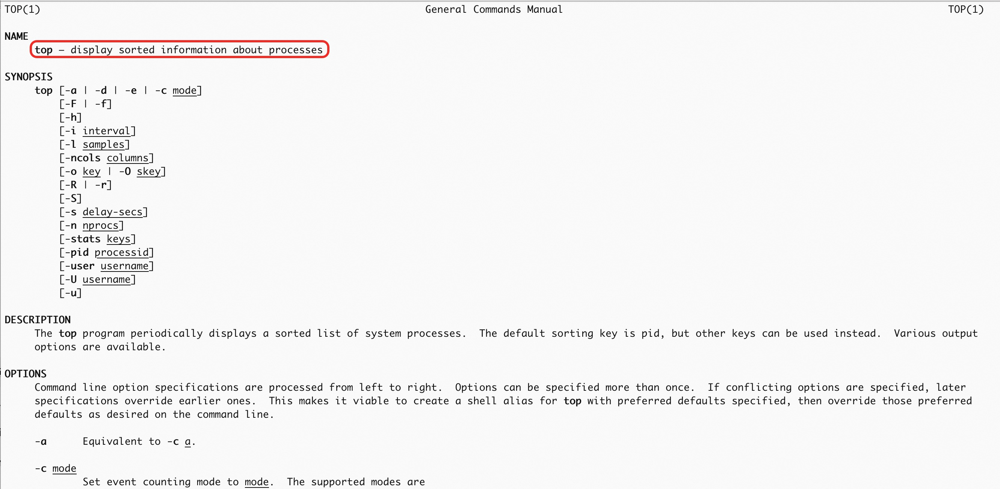
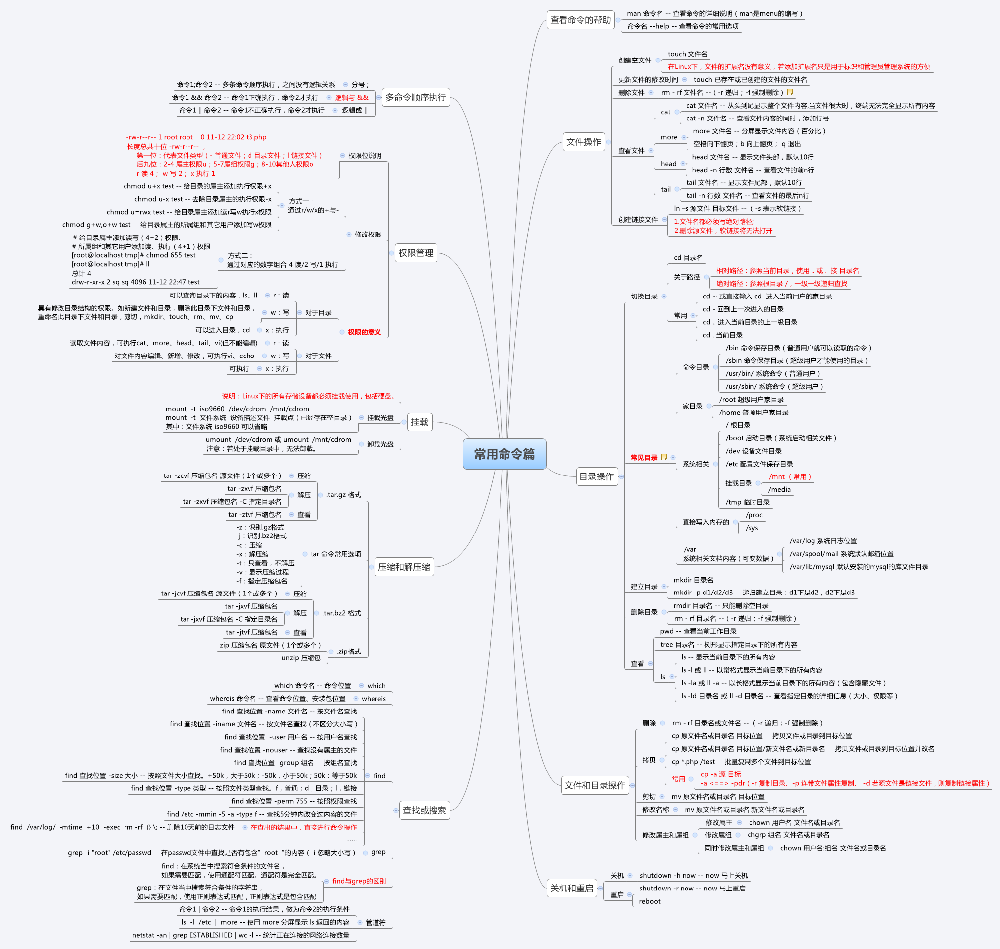
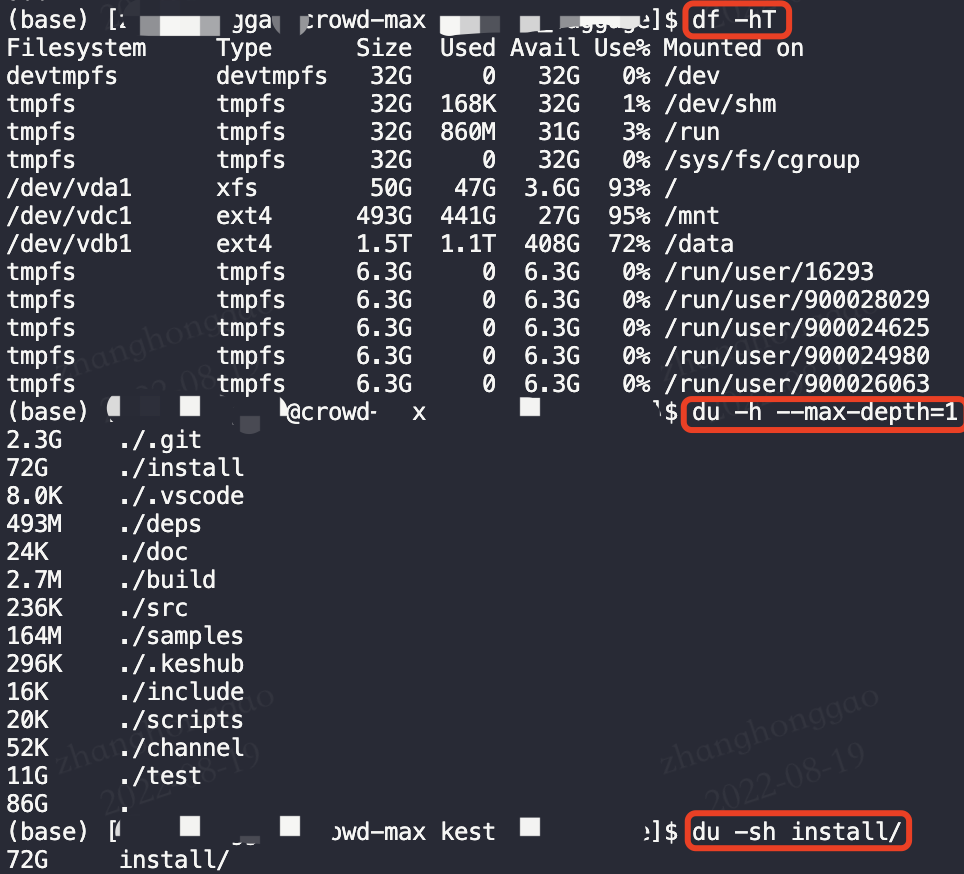
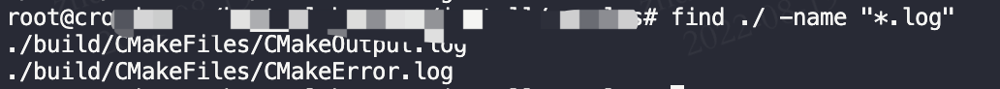
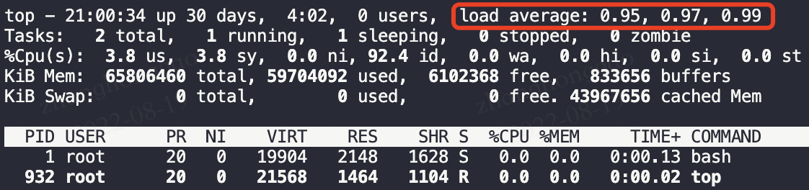
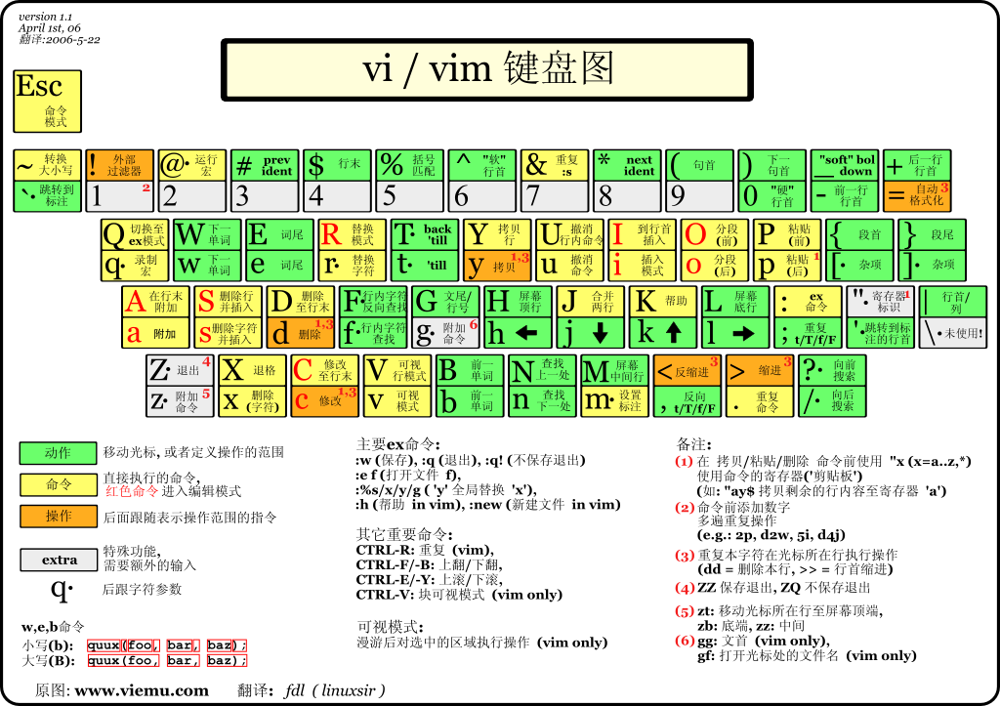
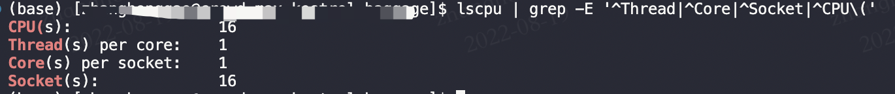
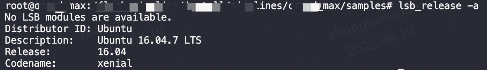
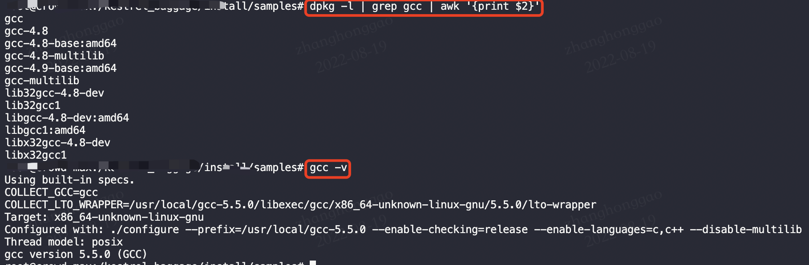

- [一 学会使用命令帮助](#一-学会使用命令帮助)
  - [1.1 使用 whatis](#11-使用-whatis)
  - [1.2 使用 man](#12-使用-man)
  - [1.3 查看命令程序路径 which](#13-查看命令程序路径-which)
- [二 Linux 新手必备命令](#二-linux-新手必备命令)
  - [2.1 系统工作](#21-系统工作)
  - [2.2 系统状态检测](#22-系统状态检测)
  - [2.3 文件与目录管理](#23-文件与目录管理)
  - [2.4 文件内容查阅与编辑](#24-文件内容查阅与编辑)
  - [2.5 打包压缩与搜索](#25-打包压缩与搜索)
  - [2.6 常见命令图解](#26-常见命令图解)
- [三 开发常用命令总结](#三-开发常用命令总结)
  - [3.1 scp 命令复制远程文件](#31-scp-命令复制远程文件)
  - [3.2 ubuntu 系统使用使用 dpkg 命令安装和卸载 .deb 包](#32-ubuntu-系统使用使用-dpkg-命令安装和卸载-deb-包)
  - [3.3 vim 查找字符串](#33-vim-查找字符串)
  - [3.4 df 和 du 命令使用](#34-df-和-du-命令使用)
  - [3.5 ls -lh 查看指定文件大小](#35-ls--lh-查看指定文件大小)
  - [3.6 ctrl + r，反向查找历史命令](#36-ctrl--r反向查找历史命令)
  - [3.7 find 查找文件和文件夹](#37-find-查找文件和文件夹)
  - [3.8 hdfs 命令详解](#38-hdfs-命令详解)
  - [3.9 top 命令进行程序性能分析](#39-top-命令进行程序性能分析)
  - [3.10 tar 压缩、解压命令](#310-tar-压缩解压命令)
  - [3.11 linux 系统特殊符号作用](#311-linux-系统特殊符号作用)
  - [3.12 linxu 中 shell 变量含义](#312-linxu-中-shell-变量含义)
  - [3.13 vim 跳转到行尾和行首命令](#313-vim-跳转到行尾和行首命令)
  - [3.14 vscode 列选择快捷键](#314-vscode-列选择快捷键)
  - [3.15 查看 cpu 信息](#315-查看-cpu-信息)
  - [3.16 mkdir -p 创建多层目录](#316-mkdir--p-创建多层目录)
  - [3.17 查看 gcc 所有安装的版本](#317-查看-gcc-所有安装的版本)
  - [3.18 查看系统版本命令](#318-查看系统版本命令)
  - [3.19 shell 读取文件每一行内容并输出](#319-shell-读取文件每一行内容并输出)
  - [3.20 实时查看 GPU 显存信息](#320-实时查看-gpu-显存信息)
  - [3.21 update-alternatives 管理软件版本](#321-update-alternatives-管理软件版本)
  - [3.22 管道和重定向命令](#322-管道和重定向命令)
  - [3.23 Bash 快捷输入或删除命令](#323-bash-快捷输入或删除命令)
  - [3.24 srun 命令行参数用法](#324-srun-命令行参数用法)
- [参考资料](#参考资料)

## 一 学会使用命令帮助

`Linux` 命令及其参数繁多，大多数人都是无法记住全部功能和具体参数意思的。在 `linux` 终端，面对命令不知道怎么用，或不记得命令的拼写及参数时，我们需要求助于系统的帮助文档； `linux` 系统内置的帮助文档很详细，通常能解决我们的问题，我们需要掌握如何正确的去使用它们。

* 需要知道某个命令的**简要说明**，可以使用 `whatis`；而更详细的介绍，则可用 `info` 命令；
* 在只记得**部分命令关键字**的场合，我们可通过 `man -k` 来搜索；
* 查看命令在哪个**位置**，我们需要使用 `which`；
* 而对于命令的**具体参数**及使用方法，我们需要用到强大的 `man` ；

下面介绍 `whatis、man、which、` 3 个帮助命令的使用。

### 1.1 使用 whatis

使用方法如下：

```bash
$ whatis ls # 查看 ls 命令的简要说明
ls (1)               - list directory contents
$ info ls  # 查看 ls 命令的详细说明，会进入一个窗口内，按 q 退出
File: coreutils.info,  Node: ls invocation,  Next: dir invocation,  Up: Directory listing
10.1 'ls': List directory contents
The 'ls' program lists information about files (of any type, including
directories).  Options and file arguments can be intermixed arbitrarily,
as usual.
... 省略
```

### 1.2 使用 man

查看命令 `cp` 的说明文档。

```bash
$ man cp  # 查看 cp 命令的说明文档，主要是命令的使用方法及具体参数意思
CP(1)      User Commands      CP(1)

NAME
       cp - copy files and directories
... 省略
```



在 `man` 的帮助手册中，将帮助文档分为了 `9` 个类别，对于有的关键字可能存在多个类别中， 我们就需要指定特定的类别来查看；（一般我们查询的 bash 命令，归类在1类中）；如我们常用的 `printf` 命令在分类 `1` 和分类 `3` 中都有(CentOS 系统例外)；分类 `1` 中的页面是命令操作及可执行文件的帮助；而3是常用函数库说明；如果我们想看的是 `C` 语言中 `printf` 的用法，可以指定查看分类 `3` 的帮助：

```bash
$man 3 printf
```

`man` 页面所属的分类标识(常用的是分类 `1` 和分类 `3` )

```bash
(1)、用户可以操作的命令或者是可执行文件
(2)、系统核心可调用的函数与工具等
(3)、一些常用的函数与数据库
(4)、设备文件的说明
(5)、设置文件或者某些文件的格式
(6)、游戏
(7)、惯例与协议等。例如Linux标准文件系统、网络协议、ASCⅡ，码等说明内容
(8)、系统管理员可用的管理条令
(9)、与内核有关的文件
```

### 1.3 查看命令程序路径 which

查看程序的 `binary` 文件所在路径，可用 `which` 命令。

```bash
$ which ls  # 查看 ping 程序(命令)的 binary 文件所在路径
/bin/ls
$ cd /bin;ls 
```

查看程序的搜索路径：

```bash
$ whereis ls
ls: /bin/ls /usr/share/man/man1/ls.1.gz
```
当系统中安装了同一软件的多个版本时，不确定使用的是哪个版本时，这个命令就能派上用场。

## 二 Linux 新手必备命令

常见执行 `Linux` 命令的格式是这样的：

```bash
命令名称 [命令参数] [命令对象]
```

注意，命令名称、命令参数、命令对象之间请用**空格键**分隔。
命令对象一般是指要处理的文件、目录、用户等资源，而命令参数可以用长格式（完整的选项名称），也可以用短格式（单个字母的缩写），两者分别用 `--` 与 `-` 作为前缀。

### 2.1 系统工作

1. `echo`：用于在 `shell` 编程中打印 `shell` 变量的值，或者直接输出指定的字符串。
2. `date`：显示或设置系统时间与日期。
3. `reboot`：重新启动正在运行的 Linux 操作系统。
4. `poweroff`：关闭计算机操作系统并且切断系统电源。
5. `wget`：用来从指定的 `URL`下载文件。wget 非常稳定，它在带宽很窄的情况下和不稳定网络中有很强的适应性，如果是由于网络的原因下载失败，wget 会不断的尝试，直到整个文件下载完毕。
6. `ps`：将某个时间点的进程运作情况撷取下来，可以搭配 `kill` 指令随时中断、删除不必要的程序。`ps` 命令可以查看进程运行的状态、进程是否结束、进程有没有僵死、哪些进程占用了过多的资源等等情况。使用 `ps -l` 则仅列出与你的操作环境 ( `bash`) 有关的进程而已；使用 `ps aux` 观察系统所有进程。
7. `top`：动态观察进程的变化。
8. `pstree`：`pstree -A` 列出目前系统上面所有的进程树的相关性。
9. `pidof`：查找指定名称的进程的进程号 `id` 号。
10. `kill`：删除执行中的程序或工作，后面必须要加上 `PID` (或者是 `job number`)，用法：`killall -signal 指令名称/PID`。`kill` 可将指定的信息送至程序，预设的信息为 `SIGTERM(15)`,可将指定程序终止，若仍无法终止该程序，可使用 `SIGKILL(9)` 信息尝试强制删除程序。程序或工作的编号可利用 `ps` 指令或 `job` 指令查看。 

### 2.2 系统状态检测

1. `ifconfig`：于配置和显示 Linux 内核中网络接口的网络参数。
2. `uname`：打印当前系统相关信息（内核版本号、硬件架构、主机名称和操作系统类型等），`-a` 或 `--all`：显示全部的信息。
3. `uptime`：打印系统总共运行了多长时间和系统的平均负载。uptime 命令可以显示的信息显示依次为：现在时间、系统已经运行了多长时间、目前有多少登陆用户、系统在过去的1分钟、5分钟和15分钟内的平均负载。
4. `free`：显示当前系统未使用的和已使用的内存数目，还可以显示被内核使用的内存缓冲区，`-m`：以MB为单位显示内存使用情况。
5. `who`：显示**目前**登录系统的用户信息。执行 `who` 命令可得知目前有那些用户登入系统，单独执行 who命令会列出登入帐号，使用的终端机，登入时间以及从何处登入或正在使用哪个 X 显示器。
6. `last`：显示用户**最近**登录信息。单独执行 last 命令，它会读取 `/var/log/wtmp` 的文件，并把该给文件的内容记录的登入系统的用户名单全部显示出来。
7. `history`：显示指定数目的指令命令，读取历史命令文件中的目录到历史命令缓冲区和将历史命令缓冲区中的目录写入命令文件。
8. `sosreport` 命令：收集并打包诊断和支持数据

### 2.3 文件与目录管理

1. `pwd` 命令：以绝对路径的方式显示用户当前工作目录。
2. `cd` 命令：切换工作目录至 `dirname`。 其中 dirName 表示法可为绝对路径或相对路径。`~` 也表示为 `home directory` 的意思，`.`则是表示目前所在的目录，`..` 则表示目前目录位置的上一层目录。
3. `cp, rm, mv`：复制、删除与移动文件或目录 。
4. `ls`：显示文件的文件/目录的名字与相关属性。`-l` 参数：长数据串行出，包含文件的属性与权限等等数据 (常用)。
5. `touch`：有两个功能：一是用于把已存在文件的时间标签更新为系统当前的时间（默认方式），它们的数据将原封不动地保留下来；二是用来创建新的空文件。
6. `file`：用来探测给定文件的类型。file 命令对文件的检查分为文件系统、魔法幻数检查和语言检查 3 个过程

### 2.4 文件内容查阅与编辑

文件内容查阅命令如下：

* `cat`：由第一行开始显示文件内容
* `tac`：从最后一行开始显示，可以看出 tac 是 cat 的倒着写！
* `nl`：显示的时候，顺道输出行号！
* `more`：一页一页的显示文件内容
* `less`：与 more 类似，但是比 more 更好的是，他可以往前翻页！
* `head`：只看头几行
* `tail`：只看尾巴几行
* `od`：以二进制的方式读取文件内容！

文件内容查阅命令总结：

* 直接查阅一个文件的内容可以使用 `cat/tac/nl` 这几个命令；
* 需要翻页检视文件内容使用 `more/less` 命令；
* 取出文件前面几行 (`head`) 或取出后面几行 (`tail`)文字的功能使用 `head` 和 `tail` 命令，注意 `head` 与 `tail` 都是以『行』为单位来进行数据撷取的；

文本内容编辑命令如下：

1. `tr`：可以用来删除一段讯息当中的文字，或者是进行文字讯息的替换。
2. `wc`：可以帮我们计算输出的讯息的整体数据。
3. `stat`：用于显示文件的状态信息。`stat` 命令的输出信息比 `ls` 命令的输出信息要更详细
4. `cut`：可以将一段讯息的某一段给他『切』出来，处理的讯息是以『行』为单位。
5. `diff`：在最简单的情况下，比较给定的两个文件的不同。如果使用 `“-”` 代替“文件”参数，则要比较的内容将来自标准输入。`diff` 命令是以逐行的方式，比较文本文件的异同处。如果该命令指定进行目录的比较，则将会比较该目录中具有相同文件名的文件，而不会对其子目录文件进行任何比较操作。

### 2.5 打包压缩与搜索

1. `tar`：利用 `tar` 命令可以把一大堆的文件和目录全部打包成一个文件，这对于备份文件或将几个文件组合成为一个文件以便于网络传输是非常有用的。注意打包是指将一大堆文件或目录变成一个总的文件；压缩则是将一个大的文件通过一些压缩算法变成一个小文件。为什么要区分这两个概念呢？这源于 Linux 中很多压缩程序只能针对一个文件进行压缩，这样当你想要压缩一大堆文件时，你得先将这一大堆文件先打成一个包（`tar` 命令），然后再用压缩程序进行压缩（`gzip bzip2` 命令）。
2. `grep`：（global search regular expression(RE) and print out the line，全面搜索正则表达式并把行打印出来）一种强大的**文本搜索工具**，能够使用正则表达式搜索文本，并把匹配的行打印出来。`grep` 它是分析一行信息， 若当中有我们所需要的信息，就将该行拿出来。用法：`grep [-acinv] [--color=auto] '搜寻字符串' filename`。
3. `which`：查找命令的完整文件名。用法：`which [-a] command`，`a` : 将所有由 `PATH` 目录中可以找到的指令均列出，而不止第一个被找到的指令名称。`find` 命令是根据`『PATH』`这个环境变量所规范的路径，去搜寻命令的完整文件名。
4. `find`：用来在指定目录下查找文件。任何位于参数之前的字符串都将被视为欲查找的目录名。如果使用该命令时，不设置任何参数，则 `find` 命令将在当前目录下查找子目录与文件。并且将查找到的子目录和文件全部进行显示。用法举例：在 `/home` 目录及其子目录下查找以 `.txt` 结尾的文件名 `find /home -name "*.txt"`。
5.  `whereis/locate`：`whereis` 只找系统中某些特定目录底下的文件而已， locate则是利用数据库来搜寻文件名，两者速度更快， 但没有实际搜寻硬盘内的文件系统状态。

### 2.6 常见命令图解
这个思维导图记录了常见命令，有利于索引，来源[Linux基础命令（01）【Linux基础命令、ip查看、目录结构、网络映射配置】](https://blog.csdn.net/zkk1973/article/details/80606832)



## 三 开发常用命令总结

### 3.1 scp 命令复制远程文件

```bash
# 从本地复制到远程：
scp local_file remote_username@remote_ip:remote_file 
# 从远程复制到本地
scp root@www.runoob.com:/home/root/others/music /home/space/music/1.mp3 
```

### 3.2 ubuntu 系统使用使用 dpkg 命令安装和卸载 .deb 包

```bash
sudo dpkg -i package_name.deb  # 安装deb包
sudo dpkg -r package_name # 卸载 deb 包
sudo apt install path_to_deb_file # 安装deb包
sudo apt remove program_name # 卸载deb 包
```

### 3.3 vim 查找字符串

在 `normal` 模式下按下 `/` 进入查找模式，输入要查找的字符串并按下回车。`Vim` 会跳转到第一个匹配，按下 `n` 查找下一个，按下 `N` 查找上一个，`vim` 还支持正则表达式查找。

### 3.4 df 和 du 命令使用

* `df` ：查看**磁盘空间**占用情况
* `du` ：查看**目录**占用的空间大小。

```bash
df -hT #查看硬盘使用情况。
du -h --max-depth=1 floder_name # 查看当前目录下所有文件/文件夹的空间大小
du -h -d 0 . # 查看当前目录空间大小
du -sh foldername # 查看指定目录空间大小
```


### 3.5 ls -lh 查看指定文件大小

```bash
$ ls -lh .bashrc  # 能查看文件空间大小,不能查看目录大小
$ find . -type l -delete # 删除当前目录下的符号链接
```

### 3.6 ctrl + r，反向查找历史命令

终端中按下 `ctrl + r`，可弹出搜索历史命令行，输入你要查找你输入过命令的关键信息，即可弹出完整历史命令。

### 3.7 find 查找文件和文件夹

`find` 支持基于正则表达式查找指定名字的文件，也支持根据文件类型、基于目录深度和文件时间戳进行搜索。

1. 查找目录：find /（查找范围） -name '查找关键字' -type d
2. 查找文件：find /（查找范围） -name 查找关键字 -print



### 3.8 hdfs 命令详解

[HDFS 常用命令](http://blog.sanyuehua.net/2017/11/01/Hadoop-HDFS/)

### 3.9 top 命令进行程序性能分析

`top` 命令是 `Linux` 下常用的性能分析工具，能够实时显示系统中各个进程的资源占用状况，类似于 `Windows` 的任务管理器。



`load average` 后面分别是 1分钟、5分钟、15分钟的负载情况。数据是每隔 5 秒钟检查一次活跃的进程数，然后根据这个数值算出来的。如果这个数除以 CPU  的数目，**结果高于 5 的时候就表明系统在超负荷运转了**。

### 3.10 tar 压缩、解压命令

* `tar -zxvf` 解压 `.tar.gz` 和 `.tgz`。
* `tar -xvf file.tar`  解压 tar 包
* `tar –cvf jpg.tar ./*.jpg`：将当前目录下所有 `jpg` 文件仅打包成 `jpg.tar` 后。
* `tar –zcvf xxx.tar.gz ./*.jpg`：打包后以 `gzip` 压缩，命名为 `xxx.tar.gz`。

在参数 `f` 之后的文件档名是自己取的，我们习惯上都用 `.tar` 来作为辨识。 如果加 `z` 参数，则以  `.tar.gz` 或  `.tgz` 来代表 `gzip` 压缩过的 `tar` 包； 如果加 `j` 参数，则以  `.tar.bz2` 来作为 `tar` 包名。

### 3.11 linux 系统特殊符号作用

1. `$`: 作为变量的前导符，引用一个变量的内容，比如：`echo $PATH`；在正则表达式中被定义为行末（`End of line`）。
2. `>>` : 表示将符号左侧的内容，以追加的方式输入到右侧文件的末尾行中。
3. `|`\*\* : 管道命令。\*\*管道命令 "|" 仅能处理前面一个命令传来的正确信息。

### 3.12 linxu 中 shell 变量含义

* `$1～$n`：添加到 `Shell` 的各参数值。`$1` 是第 `1` 参数、`$2` 是第 `2` 参数…。
* `$$`：`shell` 脚本本身的 `PID`。
* `$!`：`shell` 脚本最后运行的后台 `process` 的 `PID`。
* `$?`：最后运行的命令结束代码（返回值）。
* `$*`：所有参数列表。如 `"$*"` 用`「"」`括起来的情况、以 `"$1 $2 … $n"` 的形式输出所有参数。
* `$#`：添加到 `shell` 的参数个数。
* `$0`：`shell` 本身的文件名。

### 3.13 vim 跳转到行尾和行首命令



1. 跳到文本的最后一行行首：按`“G”`,即`“shift+g”`；
2. 跳到最后一行的最后一个字符 ： 先重复 1 的操作即按“G”，之后按“\$”键，即`“shift+4”`；
3. 跳到第一行的第一个字符：先按两次`“g”`；
4. `^` 跳转行首，`$` 跳转行尾；

### 3.14 vscode 列选择快捷键

* VSCode 列选择快捷键：Alt+Shift+左键

### 3.15 查看 cpu 信息
> 总核数 = 物理 cpu 个数 \* 每颗物理 cpu 的核数
总逻辑 cpu 数 = 物理 cpu 个数 \* 每颗物理 cpu 的核数 \* 超线程数

1. 查看物理 cpu 个数：`cat /proc/cpuinfo | grep "physical id"| sort| uniq| wc -l`
2. 查看每个物理 cpu 中的 core 个数（核数）：`cat /proc/cpuinfo| grep "cpu cores"| uniq`
3. 查看逻辑 cpu 的个数： `cat /proc/cpuinfo| grep "processor"| wc -l` 

```bash
# lscpu | grep -E '^Thread|^Core|^Socket|^CPU\(' 查看 cpu 核数和线程数
```


### 3.16 mkdir -p 创建多层目录

`mkdir -p /xxx/xxx/` 创建多层目录

### 3.17 查看 gcc 所有安装的版本

```bash
# centos 系统
rpm -qa | grep gcc | awk '{print $0}'
# ubuntu 系统
dpkg -l | grep gcc | awk '{print $2}'
# 查看系统当前使用 gcc 版本
gcc -v
```

macos 系统查看 gcc 版本

```bash
(base) honggao@U-9TK992W3-1917 ~ % gcc -v
Apple clang version 17.0.0 (clang-1700.0.13.3)
Target: arm64-apple-darwin24.3.0
Thread model: posix
InstalledDir: /Library/Developer/CommandLineTools/usr/bin
```

### 3.18 查看系统版本命令

* `lsb_release -a`:  适用于大部分 Linux 系统，会显示出完整的版本信息，`centos` 系统无法直接使用该命令，需要安装 yum install -y redhat-lsb。
* `cat /etc/os-release`: 适用于所有 Linux 系统。能显示较为全面的系统信息。
* `cat /proc/version`:  该文件记录了 Linux 内核的版本、用于编译内核的 `gcc` 的版本、内核编译的时间，以及内核编译者的用户名。




> `release` 文件通常被视为操作系统的标识。在 `/etc` 目录下放置了很多记录着发行版各种信息的文件，每个发行版都各自有一套这样记录着相关信息的文件。`LSB`（Linux 标准库Linux Standard Base）能够打印发行版的具体信息，包括发行版名称、版本号、代号等。

### 3.19 shell 读取文件每一行内容并输出

```bash
for line in `cat  test.txt`
do
    echo $line
done
```

### 3.20 实时查看 GPU 显存信息

`watch -n 1 nvidia-smi # 每1s显示一次显存信息`

### 3.21 update-alternatives 管理软件版本

`update-alternatives` 命令用于处理 Linux 系统中软件版本的切换，使其多版本共存。alternatives 程序所在目录 /etc/alternatives 。语法：

```bash
update-alternatives --help
用法：update-alternatives [<选项> ...] <命令>

命令：
  --install <链接> <名称> <路径> <优先级>
    [--slave <链接> <名称> <路径>] ...
                           在系统中加入一组候选项。
  --remove <名称> <路径>   从 <名称> 替换组中去除 <路径> 项。
  --remove-all <名称>      从替换系统中删除 <名称> 替换组。
  --auto <名称>            将 <名称> 的主链接切换到自动模式。
  --display <名称>         显示关于 <名称> 替换组的信息。
  --query <名称>           机器可读版的 --display <名称>.
  --list <名称>            列出 <名称> 替换组中所有的可用候选项。
  --get-selections         列出主要候选项名称以及它们的状态。
  --set-selections         从标准输入中读入候选项的状态。
  --config <名称>          列出 <名称> 替换组中的可选项，并就使用其中哪一个，征询用户的意见。
  --set <名称> <路径>      将 <路径> 设置为 <名称> 的候选项。
  --all                    对所有可选项一一调用 --config 命令。

<链接> 是指向 /etc/alternatives/<名称> 的符号链接。(如 /usr/bin/pager)
<名称> 是该链接替换组的主控名。(如 pager)
<路径> 是候选项目标文件的位置。(如 /usr/bin/less)
<优先级> 是一个整数，在自动模式下，这个数字越高的选项，其优先级也就越高。
..........
```

安装命令

```bash
sudo update-alternatives --install link name path priority [ --slave slink sname spath]
# 该命令完成 /usr/bin/gcc 到 /etc/alternatives/gcc 再到 /usr/local/${gcc_version}/bin/gcc 符号链接到建立。
update-alternatives --install /usr/bin/gcc gcc /usr/local/${gcc_version}/bin/gcc 100
```
选项注释:

* `link` 是在 /usr/bin/, /usr/local/bin/ 等默认PATH搜索目录
* `name` 是在 /etc/alternatives 目录中的链接名
* `path` 是真正的可执行程序的位置，可以在任何位置
* `priority` 是优先级，数字越大优先级越高

### 3.22 管道和重定向命令

* 批处理命令连接执行，使用 `|`
* 串联: 使用分号 `;`
* 前面成功，则执行后面一条，否则，不执行：`&&`
* 前面失败，则后一条执行： `||`

实例1：判断 /proc 目录是否存在，存在输出success，不存在输出 failed。

```bash
$ ls /proc > log.txt && echo  success! || echo failed.
success!
$ if ls /proc > log.txt;then echo success!;else echo failed.;fi  # 与前面脚本效果相同
success!
$ :> log.txt  # 清空文件
```

### 3.23 Bash 快捷输入或删除命令

常用快捷键：

```bash
Ctl-U   删除光标到行首的所有字符,在某些设置下,删除全行
Ctl-W   删除当前光标到前边的最近一个空格之间的字符
Ctl-H   backspace,删除光标前边的字符
Ctl-R   匹配最相近的一个文件，然后输出
```

### 3.24 srun 命令行参数用法

srun 命令常见的参数用法解释：
+ -n：指定启动的 MPI 进程数。
+ --ntasks-per-node：指定每个节点上的 MPI 进程数。
+ -c：指定每个 MPI 进程使用的 CPU 核心数量。
+ -p：指定要使用的分区或队列。
+ --mem：指定每个 MPI 进程可以使用的内存量。
+ -t：指定最长的运行时间，格式为 HH:MM:SS。
+ --gres：指定要请求的通用资源，如 GPU、InfiniBand 等。
+ -J：指定作业名称。
+ -o：指定作业输出文件名。
+ -e：指定作业错误文件名。

## 参考资料

1. [linux find 命令查找文件和文件夹](https://www.cnblogs.com/jiftle/p/9707518.html)
2. [每天一个linux命令（44）：top命令](https://www.cnblogs.com/peida/archive/2012/12/24/2831353.html)
3. [Shell中截取字符串的用法小结](https://www.cnblogs.com/kevingrace/p/8868262.html)
4. [查看 Linux 发行版名称和版本号的 8 种方法](https://linux.cn/article-9586-1.html)
5. [Linux Commands - Complete Guide](https://linoxide.com/linux-commands-brief-outline-examples/)
6. [《Linux基础》](https://linuxtools-rst.readthedocs.io/zh_CN/latest/base/index.html)
7. [新手linux命令必须掌握命令](https://man.linuxde.net/xinshoumingling)
8. [Linux基础命令（01）【Linux基础命令、ip查看、目录结构、网络映射配置】](https://blog.csdn.net/zkk1973/article/details/80606832)
