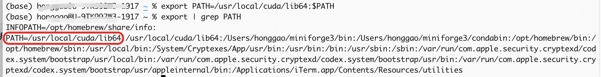

- [一 环境变量类型](#一-环境变量类型)
- [二 查看环境变量](#二-查看环境变量)
- [三 设置环境变量](#三-设置环境变量)
  - [3.1 临时添加环境变量](#31-临时添加环境变量)
  - [3.2 针对当前用户永久设置环境变量](#32-针对当前用户永久设置环境变量)
  - [3.3 针对所有用户永久设置环境变量](#33-针对所有用户永久设置环境变量)
- [参考资料](#参考资料)

## 一 环境变量类型

1，按照变量的生存周期划分，Linux 变量可分为两类：

+ **永久的**：需要修改配置文件，变量永久生效。
+ **临时的**：使用 `export` 命令声明即可，变量在关闭 `shell` 时失效。

2，按作用的范围分，在 Linux 中的变量，可以分为环境变量和本地变量：

+ **环境变量**：相当于**全局变量**，存在于所有的 Shell 中，具有继承性；
+ **本地变量**：相当于局部变量只存在当前 Shell 中，本地变量包含环境变量，非环境变量不具有继承性。

环境变量名称都是**大写**，常用的环境变量意义如下所示。

+ `PATH`：**决定了 `shell` 将到哪些目录中寻找命令或程序**。`Shell` 会依次在 `PATH` 中的各个目录里查找对应的可执行文件，找到后立即运行。
+ `HOME`：当前用户主目录
+ `HISTSIZE`：历史记录数
+ `LOGNAME`：当前用户的登录名
+ `HOSTNAME`：指主机的名称
+ `SHELL`：当前用户 Shell 类型
+ `LANGUGE`：语言相关的环境变量，多语言可以修改此环境变量
+ `MAIL`：当前用户的邮件存放目录
+ `PS1`：基本提示符，对于 root 用户是 `#`，对于普通用户是 `$`

## 二 查看环境变量

**环境变量可以由系统、用户、`Shell` 以及其他程序来设定**，保存在变量 `PATH` 中。环境变量是一个可以被赋值的字符串，赋值范围包括数字、文本、文件名、设备以及其他类型的数据。
> 值得一提的是，Linux 系统中环境变量的名称一般都是大写的，这是一种约定俗成的规范。

- 使用 `echo` 命令查看单个环境变量，例如：`echo $PATH`；
- 使用 `env` 查看**当前系统定义的所有环境变量**；
- 使用 `set` 查看所有本地定义的环境变量。查看 `PATH` 环境的实例如下：


**使用 `unset` 删除指定的环境变量**，`set` 也可以设置某个环境变量的值。清除环境变量的值用 unset 命令。如果未指定值，则该变量值将被设为 NULL。示例如下：

```shell
$ export TEST="Test..."  # 增加一个环境变量 TEST
$ env|grep TEST  # 此命令有输入，证明环境变量 TEST 已经存在了
TEST=Test...
unset  TEST  # 删除环境变量 TEST
$ env|grep TEST  # 此命令没有输出，证明环境变量 TEST 已经删除
```

2，`C` 程序调用环境变量函数

+ `getenv()`： 返回一个环境变量。
+ `setenv()`：设置一个环境变量。
+ `unsetenv()`： 清除一个环境变量。

## 三 设置环境变量

设置环境有多种用途，比如**配置交叉编译工具链的时候一般需要指定编译工具的路径**，此时就需要设置环境变量。

在 `Linux` 中**设置环境变量**有三种方法：

### 3.1 临时添加环境变量 

`export` 命令用于**设置或显示环境变量**，其只在当前终端会话中的任意脚本都有效，但是仅限于该次登陆操作，换一个终端窗口则无效。未被 export 的普通变量则只作用于当前变量。

```bash
# 将 `/usr/local/cuda/lib64` 目录临时添加到环境变量中
`export PATH=/usr/local/cuda/lib64:$PATH`
```



重新开一个终端窗口再次运行 `export | grep PATH` 就不会再有 `/usr/local/cuda/lib64` 环境变量了，因为通过 `export` 命令的是临时设置环境变量。

### 3.2 针对当前用户永久设置环境变量

- Bash 终端：`~/.bashrc` 或 `~/.bash_profile`。
- Zsh 终端：`~/.zshrc`。

示例：

```bash
echo 'export JAVA_HOME=/usr/lib/jvm/java-11-openjdk' >> ~/.bashrc
echo 'export PATH=$JAVA_HOME/bin:$PATH'      >> ~/.bashrc
echo "export PATH="/usr/local/cuda/lib64:$PATH" >> ~/.bashrc
source ~/.bashrc
```

### 3.3 针对所有用户永久设置环境变量

- `/etc/profile`：系统级的“登录 Shell”初始化脚本，在所有用户登录时被 Bash（及兼容 Bourne 的 Shell）读取，用于定义全局环境变量、PATH。
- `~/.bash_profile`：**当前用户的专属“登录 Bash Shell”初始化脚本**，仅在交互式登录时被 Bash 读取，用以设置用户特有的环境变量、别名和启动行为；若存在，它将覆盖或补充 `/etc/profile` 中的配置 

针对所有用户永久设置环境变量:`vi /etc/profile`, 即在 `/etc/profile` 文件中添加变量。

示例：编辑 `/etc/profile` 文件，添加 PATH 环境变量。

```bash
export PATH="/Users/honggao/miniforge3/bin:$PATH"
```

如果需要前面的修改立即生效，需要执行 `source /etc/profile`。

## 参考资料

1. [Linux环境变量总结](https://www.jianshu.com/p/ac2bc0ad3d74)
2. [在Linux里设置环境变量的方法（export PATH）](https://www.cnblogs.com/amboyna/archive/2008/03/08/1096024.html)