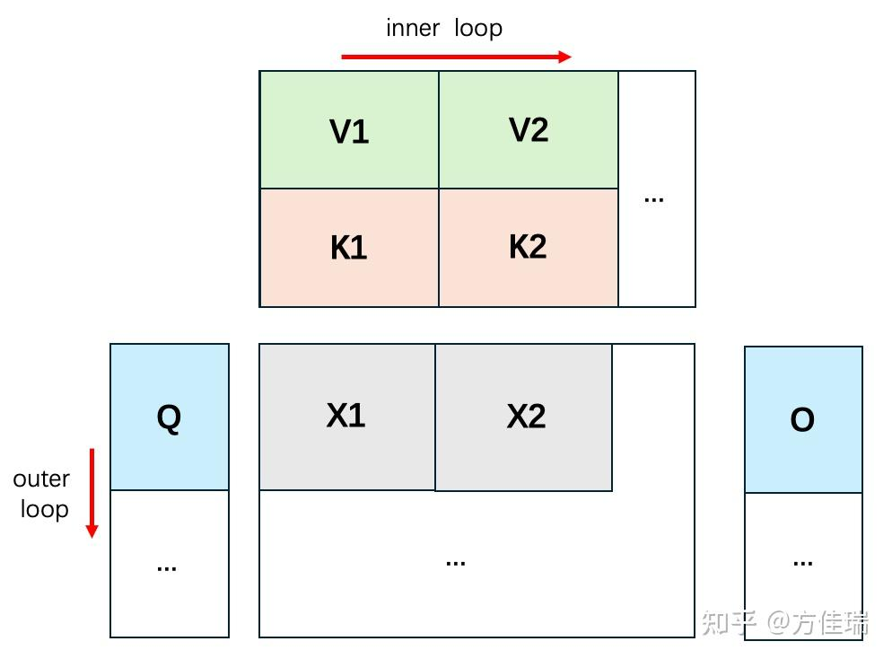

- [1. flash-attention 算法原理](#1-flash-attention-算法原理)
- [参考资料](#参考资料)

### 1. flash-attention 算法原理

标准自注意力的数学表达式如下：

$$\text{Attention}(Q, K, V) = \text{softmax}\left(\frac{QK^T}{\sqrt{d_k}}\right)V$$

其中，$d_k$ 是键向量的维度，用于缩放点积结果以防止梯度消失。

而 flashattention 是基于分块思想，如下图所示，我们从左向右计算有颜色的部分，对于 Q 增加一个外层循环，KV 增加内层循环长度，K1, K2, K3,… & V1, V2, V3, …，图中规模较小，但是泛化到更多块数据是一样的公式。

而想要复现 flash-attention 算法，我们得先回顾下 flashattention 的算法公式，这里为了方便从公式推导代码，公式部分我做了简化。

1，先看下标准 attention 计算公式：

$$\text{S = QK}^\text{T} \in \mathbb{R}^{N\times N},\quad \text{P = softmax(S)} \in \mathbb{R}^{N\times N},\quad \text{O = PV}\in \mathbb{R}^{N\times d}$$

2，前面的总结文章已经知道了 flashattention 是基于 online softmax 进一步延伸到 attention 的计算中去的，由此，先看下 online softmax 的简化公式。

### 参考资料

- [FlashAttentions](https://jcf94.com/2024/02/24/2024-02-24-flash-attention/)
- [榨干 GPU 效能的 Flash Attention 3](https://tomohiroliu22.medium.com/%E6%A6%A8%E4%B9%BEgpu%E6%95%88%E8%83%BD%E7%9A%84flashattention%E7%AC%AC%E4%B8%89%E4%BB%A3-4a8b0a2a812e)
- [FlashAttention算法之美：极简推导版](https://zhuanlan.zhihu.com/p/4264163756)