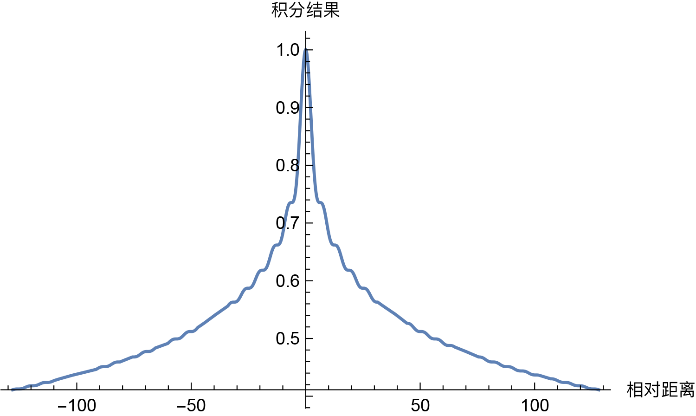
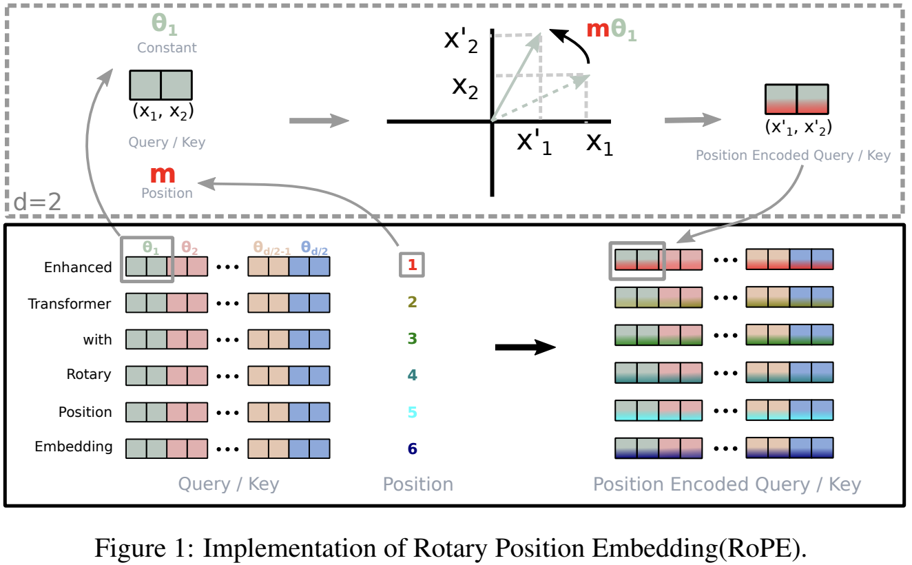
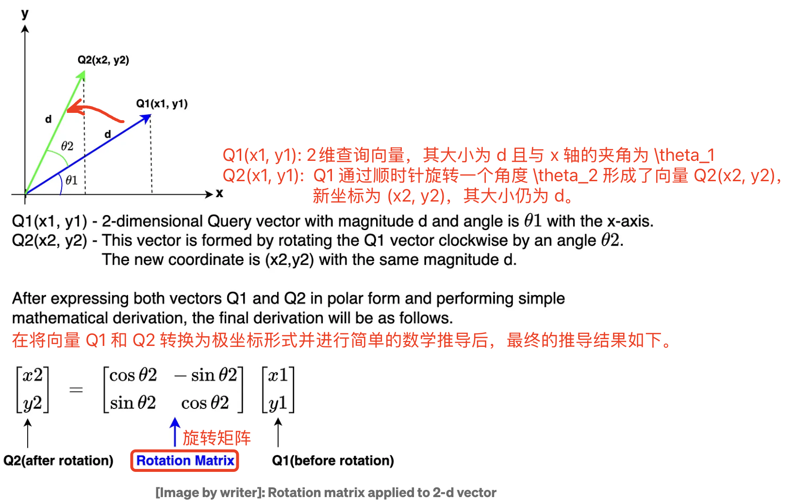
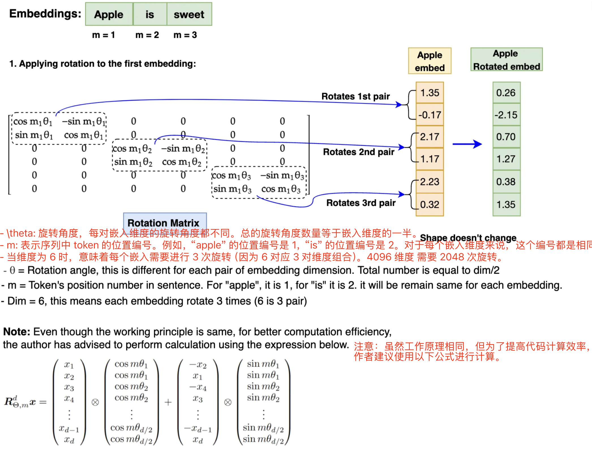
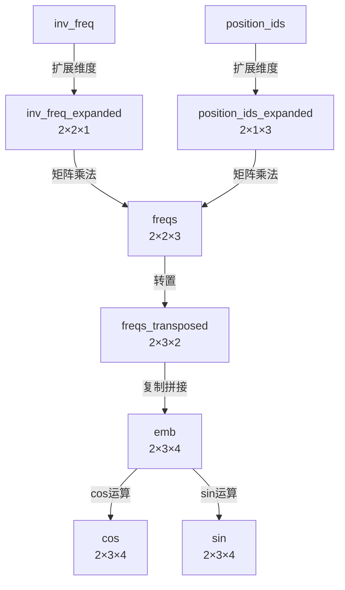
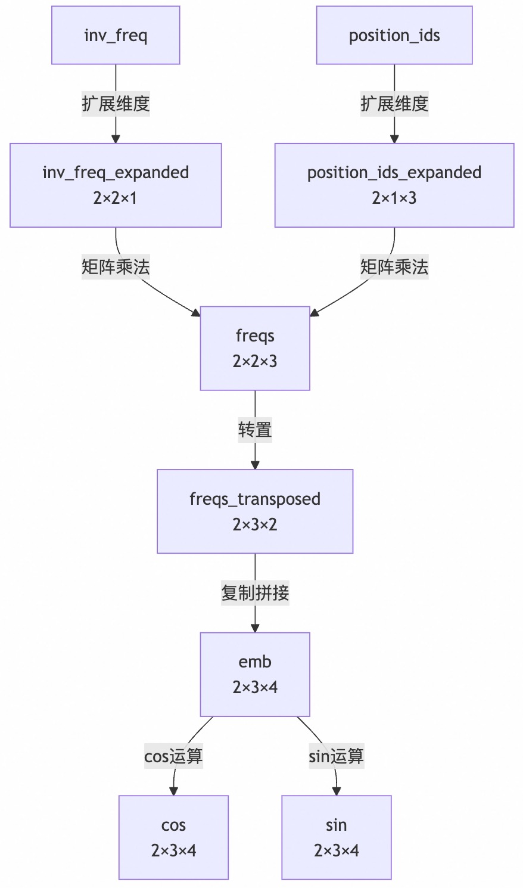
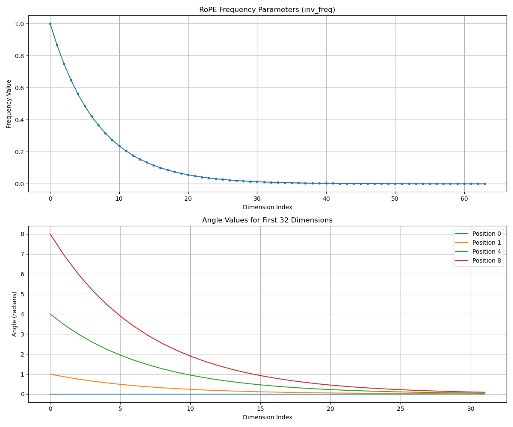

- [一 背景知识](#一-背景知识)
  - [1.1 torch 相关函数](#11-torch-相关函数)
  - [1.2 为什么需要位置编码](#12-为什么需要位置编码)
  - [1.2 正弦位置编码](#12-正弦位置编码)
- [二 旋转位置编码 RoPE](#二-旋转位置编码-rope)
  - [2.1 RoPE 算法原理](#21-rope-算法原理)
  - [2.2 二维位置编码](#22-二维位置编码)
  - [2.3 多维的 RoPE 算法](#23-多维的-rope-算法)
- [三 RoPE 的 pytorch 实现](#三-rope-的-pytorch-实现)
  - [3.1 RoPE 实现流程](#31-rope-实现流程)
  - [3.2 RoPE 的旋转矩阵实现](#32-rope-的旋转矩阵实现)
  - [3.3 apply\_rotary\_pos\_emb 实现](#33-apply_rotary_pos_emb-实现)
    - [函数 f 实现拆解](#函数-f-实现拆解)
    - [总结](#总结)
    - [测试代码](#测试代码)
- [参考资料](#参考资料)

旋转位置编码（Rotary Position Embedding，`RoPE`）是论文 Roformer: Enhanced Transformer With Rotray Position Embedding 提出的一种能够**将相对位置信息集成到 self-attention 中**，用以提升 transformer 架构性能的位置编码方式。

和 `Sinusoidal` 位置编码相比，`RoPE` 具有更好的外推性，目前是大模型相对位置编码中应用最广的算法之一。这里的外推性实质是一个**训练和预测的文本长度不一致的问题**。具体来说，不一致的地方有两点：
1. 预测的时候用到了没训练过的位置编码（不管绝对还是相对）；
2. 预测的时候注意力机制所处理的 token 数量远超训练时的数量。

RoPE 的核心思想是将**位置编码**与**词向量**通过**旋转矩阵**相乘，即将一个向量旋转某个角度，为其赋予位置信息。其具有以下优点：

1. 相对位置感知：RoPE 能够自然地捕捉词汇之间的相对位置关系。
2. 无需额外的计算：位置编码与词向量的结合在计算上是高效的。
3. 适应不同长度的序列：RoPE 可以灵活处理不同长度的输入序列。

> 三角函数、旋转矩阵、欧拉公式、复数等数学背景知识可以参考这篇[文章](./位置编码算法背景知识.md)学习。

## 一 背景知识

### 1.1 torch 相关函数

1，`torch.outer` 

函数作用：torch.outer(a, b) 计算两个 1D 向量 a 和 b 的外积，生成一个二维矩阵，其中每个元素的计算方式为：

$$\text{result}[i, j] = a[i] \times b[j]$$

即，矩阵的第 $i$ 行、第 $j$ 列的元素等于向量 a 的第 $i$ 个元素与向量 b 的第 $j$ 个元素的乘积。

外积（outer product）是指两个向量 $a$ 和 $b$ 通过外积操作生成的矩阵：

$$\mathbf{A} = a \otimes b$$

其中 $a \otimes b$ 生成一个矩阵，行数等于向量 $a$ 的元素数，列数等于向量 $b$ 的元素数。

```bash
>>> a = torch.tensor([2,3,1,1,2], dtype=torch.int8)
>>> b = torch.tensor([4,2,3], dtype=torch.int8)
>>> c = torch.outer(a, b)
>>> c.shape
torch.Size([5, 3])
>>> c
tensor([[ 8,  4,  6],
        [12,  6,  9],
        [ 4,  2,  3],
        [ 4,  2,  3],
        [ 8,  4,  6]], dtype=torch.int8)
```

2，`torch.matmul`

可以处理更高维的张量。当输入张量的维度大于 2 时，它将执行批量矩阵乘法。

```bash
>>> A = torch.randn(10, 3, 4)
>>> B = torch.randn(10, 4, 7)
>>> C = torch.matmul(A, B)
>>> D = torch.bmm(A, B)
>>> assert C.shape == D.shape # shape is torch.Size([10, 3, 7])
>>> True
```

3，`torch.polar`

```python
# 第一个参数是绝对值（模），第二个参数是角度
torch.polar(abs, angle, *, out=None) → Tensor
```

构造一个复数张量，其元素是极坐标对应的笛卡尔坐标，绝对值为 abs，角度为 angle。

$$\text{out=abs⋅cos(angle)+abs⋅sin(angle)⋅j}$$

```python
# 假设 freqs = [x, y], 则 torch.polar(torch.ones_like(freqs), freqs) 
# = [cos(x) + sin(x)j, cos(y) + sin(y)j]
>>> angle = torch.tensor([np.pi / 2, 5 * np.pi / 4], dtype=torch.float64)
>>> z = torch.polar(torch.ones_like(angle), angle)
>>> z
tensor([ 6.1232e-17+1.0000j, -7.0711e-01-0.7071j], dtype=torch.complex128)
>>> a = torch.tensor([np.pi / 2], dtype=torch.float64) # 数据类型必须和前面一样
>>> torch.cos(a)
tensor([6.1232e-17], dtype=torch.float64)
```

4，`torch.repeat_interleave`

```python
# 第一个参数是输入张量
# 第二个参数是重复次数
# dim: 沿着该维度重复元素。如果未指定维度，默认会将输入数组展平成一维，并返回一个平坦的输出数组。
torch.repeat_interleave(input, repeats, dim=None, *, output_size=None) → Tensor
```
返回一个具有与输入相同维度的重复张量

```bash
>>> keys = torch.randn([2, 12, 8, 512])
>>> keys2 = torch.repeat_interleave(keys, 8, dim = 2)
>>> keys2.shape
torch.Size([2, 12, 64, 512])
>>> x
tensor([[1, 2],
        [3, 4]])
>>> torch.repeat_interleave(x, 3, dim=1)
tensor([[1, 1, 1, 2, 2, 2],
        [3, 3, 3, 4, 4, 4]])
>>> torch.repeat_interleave(x, 3)
tensor([1, 1, 1, 3, 3, 3, 4, 4, 4, 5, 5, 5])
```

**注意重复后元素的顺序**，以简单的一维为例 `x = [a,b,c,d]`，`torch.repeat_interleave(x, 3)` 后，结果是 `[a,a,a,b,b,b,c,c,c,d,d,d]`。

### 1.2 为什么需要位置编码

假设 $q_m$ 和 $k_n$ 分别表示词向量 $q$ 位于位置 $m$ 和词向量 $k$ 位于位置 $n$，两者之间的注意力权重计算公式如下:

$$a_{m,n} = \frac{\exp\left(\frac{q_m^T k}{\sqrt{d}}\right)}{\sum_{j=1}^{N} \exp\left(\frac{q_m^T k_j}{\sqrt{d}}\right)} \\
o_m = \sum_{n=1}^{N} a_{m,n} v_n \tag{1}$$

很明显，在未加入位置信息的情况下，无论词向量 $q$ 和 $k$ 所处的位置如何变化，**$qk$ 的注意力权重 $a_{m,n}$ 均不会发生变化**，也就是**注意力权重和位置无关**，这显然不符合直觉。正常的应该是，对于两个词向量，如果它们之间的距离较近，我们希望它们之间的的注意力权重更大，当距离较远时，注意力权重更小。

为了解决上述问题，我们需要为模型引入位置编码，**让每个词向量都能够感知到它在输入序列中所处的位置信息**。定义如下函数 $f$，表示对词向量 $q$ 注入位置信息 $m$得到 $q_m$：

$$q_m = f(q, m) \tag{2}$$   

同理 $$k_n = f(k, n)$$

则 $q_m$ 与 $k_n$ 之间的注意力权重可表示为：

$$a_{m,n} = \frac{\exp\left(\frac{f(q,m)^Tf(k,n)}{\sqrt{a}}\right)}{\sum_{j=1}^{N}\exp\left(\frac{f(q,m)^Tf(k,j)}{\sqrt{a}}\right)}$$

> 注意，这里的 $f$ 其实是把 $\text{embedding}\_\text{vector} \times W_q$ 的矩阵乘法过程包含进去了。

### 1.2 正弦位置编码

方程 (2) 的一种常见（transformer 论文用的余弦位置编码）公式是：

$$f_t:t∈\{q,k,v\}(x_i, i) := W_{t}(x_i + p_i)，\tag{3}$$

其中，$p_i \in \mathbb{R}^d$  是与 `token` $x_i$ 的位置相关的 $d$ 维向量，Vaswani 等人 [2017] 则提出了通过正弦函数来生成 $p_i$ 的方法，即 Sinusoidal 位置编码：

$$p_{i,2t} = \sin\left(\frac{k}{10000^{2t/d}}\right) \\
p_{i,2t+1} = \cos\left(\frac{k}{10000^{2t/d}}\right) \tag{4}$$

其中， $p_{i,2t}$ 是 $p_i$ 的第 $2t$ 个维度。

Sinusoidal 位置编码具有远程衰减的性质，具体表现为：对于两个相同的词向量，如果它们之间的距离越近，则他们的内积分数越高，反之则越低。**远程衰减**带来的影响是使得位置编码更倾向于捕捉局部信息，限制了远程交互的影响。这种特性对短序列有效，但对长序列可能受限，即造成 Sinusoidal 位置编码外推性一般。

<div align="center">

</div>

## 二 旋转位置编码 RoPE

### 2.1 RoPE 算法原理

对于 RoPE 而言，作者的出发点为：**通过绝对位置编码的方式实现相对位置编码**。

[RoPE 论文](https://arxiv.org/pdf/2104.09864)提出为了能**利用 token 之间的相对位置信息（$m-n$）**，希望 $q_m$ 和 $k$ 之间的内积，即 $f(q, m) \cdot f(k, n)$ 中能够带有相对位置信息 $m-n$。那么问题来了， $f(q, m) \cdot f(k, n)$ 的计算如何才算带有相对位置信息，论文提出只需将其能够表示成一个关于 $q$、$k$ 以及它们之间的相对位置 $m - n$ 的函数 $g(q, k, m - n)$ 即可，公式表达如下所示：
 
$$\langle f_q(q, m), f_k(k, n) \rangle = g(q, k, m - n) \quad (5)$$

> 注意，这里只有 $f_q(q, m)$, $f_k(k, n)$ 是需要求解的函数，$\langle  \rangle$ 表示内积操作，而对于 $g$，我们要求是表达式中有 $q, k, (m-n)$，也可以说是 **$q_m, k$ 的内积会受相对位置 $m-n$ 影响**。

接下来的目标就是**找到一个等价的位置编码方式 $f$，从而使得上述关系成立**，函数 $f_q$ 包含了位置编码和 $W_q \times q$（嵌入向量转换为 $q$ 向量）过程。

### 2.2 二维位置编码

假设现在词嵌入向量的维度是两维 $d=2$，这样就可以利用上 $2$ 维度平面上的向量的几何性质，论文作者借助复数来进行求解, 提出了一个满足上述关系的 $f$ 和 $g$ 的形式如下:

$$f_q(x_m, m) = (W_q x_m) e^{im\theta} \\
f_k(x_n, n) = (W_k x_n) e^{in\theta} \\
g(x_m, x_n, m - n) = Re \left[ (W_q x_m)(W_k x_n)^* e^{i(m-n)\theta} \right] \quad (6)$$

> 其中 \( Re \) 表示复数的实部，\( (W_k k)^* \) 表示 \( (W_k k) \) 的共轭复数, $x_m$ 表示第 $m$ 个 token 向量。

$f_q、f_k$ 的推导需要基于三角函数定理、欧拉公式等，推导过程参考[这里](https://zhuanlan.zhihu.com/p/642884818)，本文直接给出结论：

1，**$f_q(q, m)$ 其实等于 `query` 向量乘以了一个旋转矩阵**，即:

$$f_q(q, m) = \begin{pmatrix} 
\cos(m\theta) & -\sin(m\theta) \\
\sin(m\theta) & \cos(m\theta)
\end{pmatrix}
\begin{pmatrix} 
q_m^{(1)} \\
q_m^{(2)} 
\end{pmatrix} \quad (7)$$

2，**$f_k(k, n)$ 其实等于 `key` 向量乘以了一个旋转矩阵**，即:

$$f_k(k, n) = \begin{pmatrix} 
\cos(n\theta) & -\sin(n\theta) \\
\sin(n\theta) & \cos(n\theta)
\end{pmatrix}
\begin{pmatrix} 
k^{(1)} \\
k^{(2)} 
\end{pmatrix} \quad (8)$$

3，同样可得 $g(q, k, m - n)$ 等于 $q_m^T$ 乘以旋转矩阵再乘以 $k$，即:

$$\langle f_q(q, m), f_k(k, n) \rangle  = \mathbf{q}_m^T R(m - n) \mathbf{k}_n \quad (9)$$

$$\begin{aligned}
g(q, k, m - n) &= (q_m^{(1)} k^{(1)} + q_m^{(2)} k^{(2)}) \cos((m - n)\theta) - (q_m^{(2)} k^{(1)} - q_m^{(1)} k^{(2)}) \sin((m - n)\theta) \\
&= \begin{pmatrix}
q_m^{(1)} & q_m^{(2)}
\end{pmatrix}
\begin{pmatrix}
\cos((m - n)\theta) & -\sin((m - n)\theta) \\
\sin((m - n)\theta) & \cos((m - n)\theta)
\end{pmatrix}
\begin{pmatrix}
k_n^{(1)} \\
k_n^{(2)}
\end{pmatrix} \\
 &= \mathbf{q}_m^T R(m - n) \mathbf{k}_n
\end{aligned} \quad(10)$$

公式（9）的证明也可通过旋转矩阵性质得到，先将公式 (9) 抽象成 $\langle R_a X, R_b Y \rangle = \langle X, R_{b-a} Y \rangle$（$R$ 表示旋转矩阵，$X、Y$ 表示向量）, 该等式的证明过程如下：


$$\begin{aligned}
\langle R_a X, R_b Y \rangle &= (R_aX)^T R_bY \\
&= X^T R_a^T R_bY \\
&=  X^T R(-a)R_bY \\
&=  X^T R_{(b-a)}Y = \langle X, R_{(b-a)}Y \rangle\\
\end{aligned} \quad(11)$$

上述推导过程分别应用了：展开内积、矩阵乘法的结合律、旋转矩阵性质1、旋转矩阵性质2。

总结：和正弦位置编码不同，**RoPE 并不是直接将位置信息 $p_i$ 和嵌入向量元素 $x_i$ 相加，而是通过与正弦函数相乘的方式引入相对位置信息**。

### 2.3 多维的 RoPE 算法

前面的公式推导，是假设的词嵌入维度是 2 维向量，将二维推广到任意维度，$f_{\{q,k\}}$ 可以表示如下：

$$f_{\{q,k\}}(q, m) = R_{\Theta, m}^d W_{\{q,k\}} q \tag{12}$$

其中，$R_{\Theta, m}^d$ 为 $d$ 维度的旋转矩阵，表示为：

$$R_{\Theta, m}^d =
\begin{pmatrix}
\cos m\theta_0 & -\sin m\theta_0 & 0 & 0 & \cdots & 0 & 0 \\
\sin m\theta_0 & \cos m\theta_0 & 0 & 0 & \cdots & 0 & 0 \\
0 & 0 & \cos m\theta_1 & -\sin m\theta_1 & \cdots & 0 & 0 \\
0 & 0 & \sin m\theta_1 & \cos m\theta_1 & \cdots & 0 & 0 \\
\vdots & \vdots & \vdots & \vdots & \ddots & \vdots & \vdots \\
0 & 0 & 0 & 0 & \cdots & \cos m\theta_{d/2-1} & -\sin m\theta_{d/2-1} \\
0 & 0 & 0 & 0 & \cdots & \sin m\theta_{d/2-1} & \cos m\theta_{d/2-1}
\end{pmatrix} \tag{13}$$

$R_{\Theta, m}^d$ 的形状是 `[sqe_len, dim//2]`。可以看出，对于 $d >= 2$ 的通用情况，则是将词嵌入向量元素按照两两一组分组，每组应用同样的旋转操作且每组的旋转角度计算方式如下：

$$
\Theta = \left\{ \theta_i = 10000^{-2(i-1)/d}, i \in [1, 2, \dots, d/2] \right\}
$$

将 RoPE 应用到前面公式（2）的 Self-Attention 计算，可以得到包含相对位置信息的Self-Attetion：

$$q_m^T k = \left( R_{\Theta, m}^d W_q q \right)^T \left( R_{\Theta, n}^d W_k k \right) = q^T W_q R_{\Theta, n-m}^d W_k k \tag{14}$$

其中，
$$R_{\Theta, n-m}^d = \left( R_{\Theta, m}^d \right)^T R_{\Theta, n}^d$$

Rotary Position Embedding(RoPE) 实现的可视化如下图所示:

<div align="center">

</div>

最后总结**结合 RoPE 的 self-attention 操作的流程**如下：
1. 首先，对于 `token` 序列中的每个词嵌入向量，都计算其对应的 query 和 key 向量;
2. 然后在得到 query 和 key 向量的基础上，应用前面 $f_q(q, m)$ 和 $f_k(k, n)$ 的计算公式（7）和（8）对每个 `token` 位置都计算对应的旋转位置编码；
3. 接着对每个 `token` 位置的 query 和 key 向量的元素按照**两两一组**应用旋转变换；
4. 最后再计算 `query` 和 `key` 之间的内积得到 self-attention 的计算结果。

## 三 RoPE 的 pytorch 实现

### 3.1 RoPE 实现流程

先看旋转矩阵用于旋转一个二维向量过程示例：

<div align="center">

</div>

但是 Llama 模型的嵌入维度高达 $4096$，比二维复杂得多，如何在更高维度的嵌入上应用旋转操作呢？通过 RoPE 算法原理我们知道，**嵌入向量的旋转实际是将每个嵌入向量元素位置 $m$ 的值与每一对嵌入维度对应的 $\theta$ 相乘**，过程如下图所示：
> RoPE 通过实现旋转矩阵，**是既捕获绝对位置信息，又结合相对位置信息的方式**（论文公式有更详细体现）。

<div align="center">

</div>

图中每组的旋转角度计算方式如下：

$$\Theta = \left\{ \theta_i = 10000^{-2(i-1)/d}, i \in [1, 2, \dots, d/2] \right\}$$

在实现 RoPE 算法之前，需要注意：为了方便代码实现，在进行旋转之前，需要将旋转矩阵转换为极坐标形式，嵌入向量（$q$、$k$）需要转换为复数形式。完成旋转后，旋转后的嵌入需要转换回实数形式，以便进行注意力计算。此外，RoPE 仅应用于查询（Query）和键（Key）的嵌入，不适用于值（Value）的嵌入。

### 3.2 RoPE 的旋转矩阵实现

`Qwen3RotaryEmbedding` 类如下所示，`forward` 用于**生成旋转矩阵** cos 和 sin。

```python
class Qwen3RotaryEmbedding(nn.Module):
    """
    用于 Qwen-3 系列模型的旋转位置编码（RoPE）张量构造器。
    该模块只负责计算 cos/sin 两张查表张量，供后续 q,k 张量做旋转。
    """
    def __init__(self, config: Qwen3Config, device: Optional[str] = None):
        super().__init__()
        
        # ---- ① 解析 RoPE 子类型 ----
        if hasattr(config, "rope_scaling") and config.rope_scaling is not None:
            self.rope_type = config.rope_scaling.get(
                "rope_type",  # 新字段
                config.rope_scaling.get("type", "default")  # 旧字段兜底
            )
        else:
            self.rope_type = "default"  # 若没配，则走默认实现

        # ---- ② 记录最大序列长度（缓存大小）----
        self.max_seq_len_cached = config.max_position_embeddings
        self.original_max_seq_len = config.max_position_embeddings

        # ---- ③ 保存 config 并选择初始化函数 ----
        self.config = config
        self.rope_init_fn = ROPE_INIT_FUNCTIONS[self.rope_type]

        # ---- ④ 生成 inv_freq 与缩放因子 ----
        #   inv_freq shape: (head_dim//2,)，内容为 1/θ^i
        #   attention_scaling: 针对部分 RoPE 变体的额外缩放
        inv_freq, self.attention_scaling = self.rope_init_fn(config, device)

        # 注册为 buffer → 保存到 state_dict，但不算模型参数
        self.register_buffer("inv_freq", inv_freq, persistent=False)
        self.original_inv_freq = self.inv_freq  # 再存一份备份，便于动态扩展
        head_dim = config.hidden_size // config.num_attention_heads
        # 打印初始化信息
        print(f"🔧 初始化 RoPE 编码器: 类型={self.rope_type}, 最大位置={self.max_seq_len_cached}")
        print(f"  头维度={head_dim}, 频率参数形状={inv_freq.shape}, 缩放因子={self.attention_scaling}")

    # --- 前向计算 ---
    @torch.no_grad()          # 不需要梯度
    @dynamic_rope_update      # 高阶装饰器：支持在线扩展 RoPE 长度
    def forward(self, x: torch.Tensor, position_ids: torch.Tensor):
        """
        参数
        ----
        x:            (bs, seq, hidden_size) 只是用来拿 dtype/device
        position_ids: (bs, seq)              每个 token 的绝对位置
        
        返回
        ----
        cos, sin: 二张查表张量，shape=(bs, seq, head_dim)
        """
        # 0. 设备处理（确保在正确设备上）
        device = x.device
        
        # 1. 将 inv_freq 尺寸 [head_dim//2] 扩展到 (bs, head_dim//2, 1)
        inv_freq_expanded = (self.inv_freq[None, :, None]  # [1, head_dim//2, 1]
                            .float()                      # 确保fp32精度
                            .expand(position_ids.shape[0], -1, 1)  # [bs, head_dim//2, 1]
                            .to(device)) # 确保张量位于正确的计算设备上（CPU或GPU）
        print("【频率因子】inv_freq shape:", inv_freq_expanded.shape)
        print("【拓展后的频率因子】inv_freq_expanded shape:", inv_freq_expanded.shape)

        # 2. 将 position_ids (bs, seq) 扩展到 (bs, 1, seq)
        position_ids_expanded = position_ids[:, None, :].float()  # [bs, 1, seq]

        # 3. 指定 autocast 的设备类型（MPS 例外需退回 cpu）
        device_type = "cpu" if device.type == "mps" else device.type

        # 4. 强制禁用 autocast → 用 fp32 计算角度，防止精度损失
        with torch.autocast(device_type=device_type, enabled=False):
            # 矩阵乘法: [bs, head_dim//2, 1] @ (bs, 1, seq) → (bs, head_dim//2, seq)
            # 结果 freqs 张量包含了用于后续sin/cos计算的角度值。
            freqs = torch.matmul(inv_freq_expanded, position_ids_expanded)
            
            # 转置: (bs, head_dim//2, seq) → (bs, seq, head_dim//2)
            freqs = freqs.transpose(1, 2)
            
            # 拼接偶、奇维度 → (bs, seq, head_dim)
            emb = torch.cat((freqs, freqs), dim=-1)

            # 取 cos / sin（再乘可选 scaling）
            cos = emb.cos() * self.attention_scaling
            sin = emb.sin() * self.attention_scaling

        # 5. 与输入张量保持一致的 dtype 返回
        return cos.to(dtype=x.dtype), sin.to(dtype=x.dtype)
```

`forward` 函数的计算流程可视化如下所示:



<div align="center">

</div>

`concat` 拼接操作的意义体现了 RoPE 的核心设计思想：每个频率分量会同时用于生成 cos 和 sin 值，用于对应的偶数和奇数维度位置。

上述 Qwen3RotaryEmbedding 类的测试代码如下所示:

```python
import torch
import torch.nn as nn
from typing import Optional, Tuple
import numpy as np

# 定义装饰器（如果没有动态更新需求，可以使用空装饰器）
def dynamic_rope_update(func):
    return func

# 定义RoPE初始化函数字典
ROPE_INIT_FUNCTIONS = {
    "default": lambda config, device: default_rope_init(config, device),
    # 添加其他初始化类型...
}

def default_rope_init(config, device) -> Tuple[torch.Tensor, float]:
    """默认RoPE初始化函数"""
    # 计算每个头的维度
    head_dim = config.hidden_size // config.num_attention_heads
    
    # 计算基础频率
    base = getattr(config, "rope_theta", 10000.0)
    inv_freq = 1.0 / (base ** (torch.arange(0, head_dim, 2, device=device).float() / head_dim))
    
    # 默认缩放因子为1.0
    attention_scaling = 1.0
    return inv_freq, attention_scaling

# 简化的配置类
class Qwen3Config:
    def __init__(self, rope_scaling=None, max_position_embeddings=4096, 
                 hidden_size=4096, num_attention_heads=32, rope_theta=10000.0):
        self.rope_scaling = rope_scaling
        self.max_position_embeddings = max_position_embeddings
        self.hidden_size = hidden_size
        self.num_attention_heads = num_attention_heads
        self.rope_theta = rope_theta

# ===== 增强版测试函数 =====
def test_rotary_embedding(visualize: bool = True):
    """全面测试 RoPE 实现并输出详细分析"""
    print("\n" + "="*60)
    print("🔥 Qwen-3 RoPE 旋转位置编码 全面测试")
    print("="*60)
    
    # 配置参数
    bs, seq, n_heads, head_dim = 2, 16, 32, 128
    hidden_size = n_heads * head_dim
    
    print(f"\n📋 测试配置:")
    print(f"  批大小 (bs) = {bs}")
    print(f"  序列长度 (seq) = {seq}")
    print(f"  注意力头数 (n_heads) = {n_heads}")
    print(f"  每个头的维度 (head_dim) = {head_dim}")
    print(f"  总隐藏大小 (hidden_size) = {hidden_size}")
    
    # 创建配置对象
    dummy_cfg = Qwen3Config(
        rope_scaling={"rope_type": "default"},
        max_position_embeddings=4096,
        hidden_size=hidden_size,
        num_attention_heads=n_heads,
        rope_theta=10000.0
    )

    # 创建RoPE模块
    print("\n🛠 创建 RoPE 编码器...")
    rot = Qwen3RotaryEmbedding(dummy_cfg, device="cpu")
    
    # 打印频率参数信息
    inv_freq = rot.inv_freq.cpu().numpy()
    print(f"\n📊 频率参数分析 (inv_freq):")
    print(f"  形状: {inv_freq.shape}")
    print(f"  最小值: {inv_freq.min():.6f}")
    print(f"  最大值: {inv_freq.max():.6f}")
    print(f"  平均值: {inv_freq.mean():.6f}")
    print(f"  前5个值: {inv_freq[:5].round(6)}")
    
    # 创建测试数据
    x = torch.randn(bs, seq, hidden_size)  # 模拟输入
    position_ids = torch.arange(seq).repeat(bs, 1)  # (bs, seq)
    
    print("\n⚡ 计算 RoPE 编码...")
    cos, sin = rot(x, position_ids)
    
    # 验证输出
    print("\n✅ 输出验证:")
    print(f"  cos 形状: {cos.shape} → (批大小, 序列长度, head_dim)")
    print(f"  sin 形状: {sin.shape}")
    
    # 验证三角函数性质
    cos_sin_sum = cos**2 + sin**2
    error = (cos_sin_sum - 1).abs().max()
    print(f"\n🔍 数学性质验证 (cos²θ + sin²θ = 1):")
    print(f"  最大误差: {error.item():.3e}")
    print(f"  是否接近1 (误差 < 1e-6): {'是' if error < 1e-6 else '否'}")

    # 分析位置差异
    print("\n🌐 位置编码差异分析:")
    for pos_diff in [0, 1, 4, 8]:
        # 计算位置差为pos_diff时的点积
        dot_products = []
        for i in range(0, seq - pos_diff):
            q = cos[0, i] * sin[0, i + pos_diff] - sin[0, i] * cos[0, i + pos_diff]
            dot_products.append(q.mean().item())
        
        avg_dot = np.mean(dot_products)
        print(f"  位置差 {pos_diff:2d}: 平均点积 = {avg_dot:.4f}")

    # 可视化部分
    if visualize:
        try:
            import matplotlib.pyplot as plt
            # 1. 频率参数可视化
            plt.figure(figsize=(12, 10))
            
            # 频率参数
            plt.subplot(2, 1, 1)
            plt.plot(inv_freq, 'o-', markersize=3)
            plt.title("RoPE Frequency Parameters (inv_freq)")
            plt.xlabel("Dimension Index")
            plt.ylabel("Frequency Value")
            plt.grid(True)
            
            # 2. 不同位置的角度变化
            plt.subplot(2, 1, 2)
            positions_to_plot = [0, 1, 4, 8]
            dims_to_plot = min(32, head_dim)
            
            # 取第一个batch的不同位置
            for pos in positions_to_plot:
                # 计算角度 (θ = position * inv_freq)
                angles = (position_ids[0, pos] * rot.inv_freq).cpu().numpy()
                plt.plot(angles[:dims_to_plot], label=f"Position {pos}")
            
            plt.title(f"Angle Values for First {dims_to_plot} Dimensions")
            plt.xlabel("Dimension Index")
            plt.ylabel("Angle (radians)")
            plt.legend()
            plt.grid(True)
            plt.tight_layout()
            plt.savefig("rope_analysis.png")
            print("\n📈 可视化已保存至 rope_analysis.png")
            
            # 3. 位置差异热力图
            plt.figure(figsize=(10, 8))
            max_pos = 10  # 只显示前10个位置
            
            # 计算相对位置编码的差异
            position_diff = np.zeros((max_pos, max_pos))
            for i in range(max_pos):
                for j in range(max_pos):
                    # 计算点积作为相似度
                    sim = (cos[0, i] * cos[0, j] + sin[0, i] * sin[0, j]).mean().item()
                    position_diff[i, j] = sim
            
            plt.imshow(position_diff, cmap='viridis', origin='lower')
            plt.colorbar(label='Position Similarity')
            plt.title("Position Encoding Similarity Heatmap")
            plt.xlabel("Position j")
            plt.ylabel("Position i")
            plt.xticks(range(max_pos))
            plt.yticks(range(max_pos))
            plt.savefig("position_similarity.png")
            print("📊 位置相似度热力图已保存至 position_similarity.png")
            
        except ImportError:
            print("\n⚠ 无法导入 matplotlib，跳过可视化部分")
    
    print("\n🎉 测试完成!")

# 执行测试
if __name__ == "__main__":
    test_rotary_embedding(visualize=True)
```

上述程序运行后输出结果如下所示:

```bash
============================================================
🔥 Qwen-3 RoPE 旋转位置编码 全面测试
============================================================

📋 测试配置:
  批大小 (bs) = 2
  序列长度 (seq) = 16
  注意力头数 (n_heads) = 32
  每个头的维度 (head_dim) = 128
  总隐藏大小 (hidden_size) = 4096

🛠 创建 RoPE 编码器...
🔧 初始化 RoPE 编码器: 类型=default, 最大位置=4096
  头维度=128, 频率参数形状=torch.Size([64]), 缩放因子=1.0

📊 频率参数分析 (inv_freq):
  形状: (64,)
  最小值: 0.000115
  最大值: 1.000000
  平均值: 0.116562
  前5个值: [1.       0.865964 0.749894 0.649382 0.562341]

⚡ 计算 RoPE 编码...
inv_freq_expanded shape: torch.Size([2, 64, 1])

✅ 输出验证:
  cos 形状: torch.Size([2, 16, 128]) → (批大小, 序列长度, head_dim)
  sin 形状: torch.Size([2, 16, 128])

🔍 数学性质验证 (cos²θ + sin²θ = 1):
  最大误差: 1.192e-07
  是否接近1 (误差 < 1e-6): 是

🌐 位置编码差异分析:
  位置差  0: 平均点积 = 0.0000
  位置差  1: 平均点积 = 0.1094
  位置差  4: 平均点积 = 0.1844
  位置差  8: 平均点积 = 0.1783

📈 可视化已保存至 rope_analysis.png
📊 位置相似度热力图已保存至 position_similarity.png
```



RoPE Frequency Parameters 解释:

- X轴: Dimension Index (维度索引)
- Y轴: Frequency Value (频率值)

展示频率参数随维度索引的变化

- Angle Values for First N Dimensions:
- X轴: Dimension Index (维度索引)
- Y轴: Angle (radians) (角度值，弧度)
- 不同颜色代表不同位置(0,1,4,8)在各维度的角度值

### 3.3 apply_rotary_pos_emb 实现

#### 函数 f 实现拆解

得到旋转矩阵后，再应用旋转矩阵位置编码，得到集成了相对位置信息的 $q$ 和 $k$，核心公式拆解分析如下。

RoPE 的核心思想是通过旋转操作将位置信息编码到查询和键向量中。对于位置 $m$ 的查询向量 $q_m$ 和位置 $n$ 的键向量 $k_n$，旋转后的向量为：

$$\tilde{q}_m = R_m q_m \\
\tilde{k}_n = R_n k_n$$

其中 $R_m$ 和 $R_n$ 是位置相关的旋转矩阵。旋转后，点积结果仅依赖于相对位置 (m-n)：

$$\tilde{q}_m^T \tilde{k}_n = (R_m q_m)^T (R_n k_n) = q_m^T R_m^T R_n k_n = q_m^T R_{m-n} k_n$$

代码实现逐步分析：

```python
def rotate_half(x):
    """Rotates half the hidden dims of the input."""
    # 将最后一个维度一分为二
    x1 = x[..., : x.shape[-1] // 2]
    x2 = x[..., x.shape[-1] // 2 :]
    # 拼接 -x2 与 x1
    return torch.cat((-x2, x1), dim=-1)
```

上述函数实现了二维旋转矩阵的核心操作。在二维空间中，旋转矩阵为：

$$R(\theta) = \begin{bmatrix}
\cos \theta & -\sin \theta \\
\sin \theta & \cos \theta
\end{bmatrix}$$

当应用于向量 $[x, y]$ 时：

$$R(\theta) \begin{bmatrix} x \\ y \end{bmatrix} = 
\begin{bmatrix}
x \cos \theta - y \sin \theta \\
x \sin \theta + y \cos \theta
\end{bmatrix}$$

rotate_half 函数计算了旋转操作的一部分：$-y$ 和 $x$，对应旋转矩阵的第二列。

`apply_rotary_pos_emb` 的 pytorch 代码如下所示:

```python
def apply_rotary_pos_emb(q, k, cos, sin, position_ids=None, unsqueeze_dim=1):
    # 调整 cos/sin 形状以匹配 q/k 的维度
    cos = cos.unsqueeze(unsqueeze_dim)  # 添加新维度
    sin = sin.unsqueeze(unsqueeze_dim)  # 添加新维度
    
    # 应用旋转位置嵌入到查询向量
    q_embed = (q * cos) + (rotate_half(q) * sin)
    
    # 应用旋转位置嵌入到键向量
    k_embed = (k * cos) + (rotate_half(k) * sin)
    
    return q_embed, k_embed
```

函数实现了完整的旋转操作：

$$\tilde{q}_m = q_m \odot \cos(m\theta) + \text{rotate\_half}(q_m) \odot \sin(m\theta)$$

其中：

- `q * cos` 对应旋转矩阵的第一列操作：$x \cdot cos \theta$
- `rotate_half(q) * sin` 对应旋转矩阵的第二列操作：$(-y sin \theta, x sin \theta)$

当两者相加时，就完成了完整的旋转操作：

$$\begin{bmatrix}
x \cos \theta - y \sin \theta \\
x \sin \theta + y \cos \theta
\end{bmatrix} = 
\begin{bmatrix}
x \\
y
\end{bmatrix} \cos \theta + 
\begin{bmatrix}
-y \\
x
\end{bmatrix} \sin \theta$$

RoPE 将高维空间分解为多个二维子空间，在每个子空间上独立应用旋转：

$$R_{\Theta,m}^d = 
\begin{pmatrix}
\cos m\theta_1 & -\sin m\theta_1 & 0 & \cdots & 0 \\
\sin m\theta_1 & \cos m\theta_1 & 0 & \cdots & 0 \\
0 & 0 & \cos m\theta_2 & -\sin m\theta_2 & \cdots \\
\vdots & \vdots & \vdots & \ddots & \vdots \\
0 & 0 & \cdots & \cos m\theta_{d/2} & -\sin m\theta_{d/2} \\
0 & 0 & \cdots & \sin m\theta_{d/2} & \cos m\theta_{d/2}
\end{pmatrix}$$

#### 总结

代码中通过以下方式实现这种分组处理：

1. rotate_half 函数将输入向量分为前后两半
2. 对每个二维子空间应用相同的旋转公式
3. 不同子空间使用不同的旋转频率 $\theta_i$

#### 测试代码

`apply_rotary_pos_emb` 测试代码如下所示:

```python
import torch, math
import numpy as np

def rotate_half(x):
    """旋转输入的一半隐藏维度"""
    x1 = x[..., : x.shape[-1] // 2]
    x2 = x[..., x.shape[-1] // 2 :]
    return torch.cat((-x2, x1), dim=-1)

def apply_rotary_pos_emb(q, k, cos, sin, position_ids=None, unsqueeze_dim=1):
    cos = cos.unsqueeze(unsqueeze_dim)
    sin = sin.unsqueeze(unsqueeze_dim)
    q_embed = (q * cos) + (rotate_half(q) * sin)
    k_embed = (k * cos) + (rotate_half(k) * sin)
    return q_embed, k_embed

def test_apply_rotary_pos_emb():
    """全面测试 RoPE 应用函数并输出详细分析"""
    print("\n" + "="*90)
    print("🔥 旋转位置编码(RoPE)应用函数 - 全面测试")
    print("="*90)
    
    # 测试配置
    batch_size, seq_len, num_heads, head_dim = 2, 16, 32, 128
    total_params = batch_size * num_heads * seq_len * head_dim * 2
    
    print("\n📋 测试配置:")
    print(f"  批大小: {batch_size}")
    print(f"  序列长度: {seq_len}")
    print(f"  注意力头数量: {num_heads}")
    print(f"  头维度: {head_dim}")
    print(f"  处理参数总量: {total_params:,} (≈{total_params/1e6:.1f}M)")
    print(f"  使用 RoPE 实现: {apply_rotary_pos_emb.__name__}")
    
    # 创建模拟数据
    torch.manual_seed(42)
    
    print("\n🔧 创建测试数据...")
    q = torch.randn(batch_size, num_heads, seq_len, head_dim)
    k = torch.randn(batch_size, num_heads, seq_len, head_dim)
    
    print("\n📐 旋转前张量形状验证:")
    print(f"  q 形状: {q.shape} [批大小, 头数, 序列长度, 头维度]")
    print(f"  k 形状: {k.shape} [批大小, 头数, 序列长度, 头维度]")

    # 修复原始查询向量显示问题 - 确保使用正确的索引
    print("\n🔍 原始查询向量 (批次=0, 头=0, 位置=0):")
    print(f"  形状: {q[0, 0, 0].shape}")
    print(f"  前10个元素: {q[0, 0, 0][:10].numpy().round(4)}")
    print(f"  范数: {torch.norm(q[0, 0, 0]).item():.4f}")
    
    # 显示不同位置的向量以增强可观察性
    print("\n🔍 原始查询向量 (批次=0, 头=0, 位置=15):")
    print(f"  前10个元素: {q[0, 0, 15][:10].numpy().round(4)}")
    print(f"  范数: {torch.norm(q[0, 0, 15]).item():.4f}")
    
    # 创建位置编码
    print("\n⚙️ 生成位置编码...")
    cos = torch.zeros(batch_size, seq_len, head_dim)
    sin = torch.zeros(batch_size, seq_len, head_dim)
    
    print("\n  位置编码（旋转矩阵）形状验证:")
    print(f"  cos 形状: {cos.shape} [批大小, 序列长度, 头维度]")
    print(f"  sin 形状: {sin.shape} [批大小, 序列长度, 头维度]")

    for b in range(batch_size):
        for pos in range(seq_len):
            angle = pos * 0.1
            for d in range(head_dim):
                freq = 0.5 ** (d // 2)
                cos[b, pos, d] = math.cos(angle * freq)
                sin[b, pos, d] = math.sin(angle * freq)
    
    print("\n📊 位置编码示例:")
    print("  批次=0, 位置=0:")
    print(f"    cos[:10]: {cos[0, 0, :10].numpy().round(4)}")
    print(f"    sin[:10]: {sin[0, 0, :10].numpy().round(4)}")
    
    print("  批次=0, 位置=1:")
    print(f"    cos[:10]: {cos[0, 1, :10].numpy().round(4)}")
    print(f"    sin[:10]: {sin[0, 1, :10].numpy().round(4)}")
    
    # 应用旋转位置嵌入
    print("\n⚡ 应用旋转位置编码...")
    q_rot, k_rot = apply_rotary_pos_emb(q, k, cos, sin, unsqueeze_dim=1)
    print("  ✅ 旋转应用成功")
    
    # 增加 q_embed 和 k_embed 形状打印
    print("\n📐 旋转后张量形状验证:")
    print(f"  q_embed 形状: {q_rot.shape} [批大小, 头数, 序列长度, 头维度]")
    print(f"  k_embed 形状: {k_rot.shape} [批大小, 头数, 序列长度, 头维度]")

    # 验证输出形状
    print("\n✅ 输出验证:")
    print(f"  旋转后查询向量形状: {q_rot.shape} (应与输入相同)")
    print(f"  旋转后键向量形状: {k_rot.shape}")
    
    # 增强的旋转前后对比
    print("\n🔄 旋转前后对比 (批次=0, 头=0, 位置=0):")
    print("  原始向量:")
    print(f"    前10个元素: {q[0, 0, 0][:10].numpy().round(4)}")
    print(f"    范数: {torch.norm(q[0, 0, 0]).item():.4f}")
    
    print("  旋转后向量:")
    print(f"    前10个元素: {q_rot[0, 0, 0][:10].numpy().round(4)}")
    print(f"    范数: {torch.norm(q_rot[0, 0, 0]).item():.4f}")
    
    print("\n🔄 旋转前后对比 (批次=0, 头=0, 位置=15):")
    print("  原始向量:")
    print(f"    前10个元素: {q[0, 0, 15][:10].numpy().round(4)}")
    print(f"    范数: {torch.norm(q[0, 0, 15]).item():.4f}")
    
    print("  旋转后向量:")
    print(f"    前10个元素: {q_rot[0, 0, 15][:10].numpy().round(4)}")
    print(f"    范数: {torch.norm(q_rot[0, 0, 15]).item():.4f}")
    
    # 验证模长不变性
    print("\n🔍 范数保持验证:")
    max_diff = 0.0
    for b in range(batch_size):
        for h in range(num_heads):
            for pos in range(seq_len):
                orig_norm = torch.norm(q[b, h, pos]).item()
                rot_norm = torch.norm(q_rot[b, h, pos]).item()
                diff = abs(orig_norm - rot_norm)
                max_diff = max(max_diff, diff)
    
    print(f"  最大范数差异: {max_diff:.6f}")
    if max_diff < 1e-5:
        print("  ✅ 通过: 所有向量范数保持稳定 (<1e-5)")
    else:
        print(f"  ⚠ 警告: 某些位置的范数差异超出容差范围 (最大差异 = {max_diff:.6f})")
    
    # 验证相对位置性质
    print("\n🌐 相对位置特性验证:")
    print("  计算位置0与其他位置的相似度...")
    print("  (RoPE中，相似度应随位置差增大而减小)")
    
    print("\n  位置对 | 相似度 | 与前一位置差异")
    print("  -------|--------|-----------------")
    
    prev_sim = None
    for pos_diff in [0, 1, 2, 4, 8]:
        if seq_len > pos_diff:
            dot_product = (q_rot[0, 0, 0] @ q_rot[0, 0, pos_diff]).item()
            
            diff_str = ""
            if prev_sim is not None:
                diff = prev_sim - dot_product
                diff_str = f"{diff:+.6f}" if diff > 0 else f"{diff:.6f}"
            
            print(f"  0 vs {pos_diff:2d} | {dot_product:.6f} | {diff_str}")
            prev_sim = dot_product

# 执行测试
if __name__ == "__main__":
    test_apply_rotary_pos_emb()
```

程序运行后输出结果如下所示:

```bash
==========================================================================================
🔥 旋转位置编码(RoPE)应用函数 - 全面测试
==========================================================================================

📋 测试配置:
  批大小: 2
  序列长度: 16
  注意力头数量: 32
  头维度: 128
  处理参数总量: 262,144 (≈0.3M)
  使用 RoPE 实现: apply_rotary_pos_emb

🔧 创建测试数据...

📐 旋转前张量形状验证:
  q 形状: torch.Size([2, 32, 16, 128]) [批大小, 头数, 序列长度, 头维度]
  k 形状: torch.Size([2, 32, 16, 128]) [批大小, 头数, 序列长度, 头维度]

🔍 原始查询向量 (批次=0, 头=0, 位置=0):
  形状: torch.Size([128])
  前10个元素: [ 1.9269  1.4873  0.9007 -2.1055  0.6784 -1.2345 -0.0431 -1.6047 -0.7521
  1.6487]
  范数: 10.8772

🔍 原始查询向量 (批次=0, 头=0, 位置=15):
  前10个元素: [ 0.5484  0.4577  0.9677 -0.6674  1.6183 -0.2644  1.3541 -0.0709 -0.3697
 -0.246 ]
  范数: 10.4785

⚙️ 生成位置编码...

  位置编码（旋转矩阵）形状验证:
  cos 形状: torch.Size([2, 16, 128]) [批大小, 序列长度, 头维度]
  sin 形状: torch.Size([2, 16, 128]) [批大小, 序列长度, 头维度]

📊 位置编码示例:
  批次=0, 位置=0:
    cos[:10]: [1. 1. 1. 1. 1. 1. 1. 1. 1. 1.]
    sin[:10]: [0. 0. 0. 0. 0. 0. 0. 0. 0. 0.]
  批次=0, 位置=1:
    cos[:10]: [0.995  0.995  0.9988 0.9988 0.9997 0.9997 0.9999 0.9999 1.     1.    ]
    sin[:10]: [0.0998 0.0998 0.05   0.05   0.025  0.025  0.0125 0.0125 0.0062 0.0062]

⚡ 应用旋转位置编码...
  ✅ 旋转应用成功

📐 旋转后张量形状验证:
  q_embed 形状: torch.Size([2, 32, 16, 128]) [批大小, 头数, 序列长度, 头维度]
  k_embed 形状: torch.Size([2, 32, 16, 128]) [批大小, 头数, 序列长度, 头维度]

✅ 输出验证:
  旋转后查询向量形状: torch.Size([2, 32, 16, 128]) (应与输入相同)
  旋转后键向量形状: torch.Size([2, 32, 16, 128])

🔄 旋转前后对比 (批次=0, 头=0, 位置=0):
  原始向量:
    前10个元素: [ 1.9269  1.4873  0.9007 -2.1055  0.6784 -1.2345 -0.0431 -1.6047 -0.7521
  1.6487]
    范数: 10.8772
  旋转后向量:
    前10个元素: [ 1.9269  1.4873  0.9007 -2.1055  0.6784 -1.2345 -0.0431 -1.6047 -0.7521
  1.6487]
    范数: 10.8772

🔄 旋转前后对比 (批次=0, 头=0, 位置=15):
  原始向量:
    前10个元素: [ 0.5484  0.4577  0.9677 -0.6674  1.6183 -0.2644  1.3541 -0.0709 -0.3697
 -0.246 ]
    范数: 10.4785
  旋转后向量:
    前10个元素: [-0.6945  0.301   0.4007 -0.5162  1.5313 -0.3407  1.2414  0.2079 -0.247
 -0.3272]
    范数: 10.4008

🔍 范数保持验证:
  最大范数差异: 0.487347
  ⚠ 警告: 某些位置的范数差异超出容差范围 (最大差异 = 0.487347)

🌐 相对位置特性验证:
  计算位置0与其他位置的相似度...
  (RoPE中，相似度应随位置差增大而减小)

  位置对 | 相似度 | 与前一位置差异
  -------|--------|-----------------
  0 vs  0 | 118.314240 | 
  0 vs  1 | 20.345375 | +97.968864
  0 vs  2 | -4.198829 | +24.544204
  0 vs  4 | 8.441195 | -12.640023
  0 vs  8 | -8.702080 | +17.143274
```

## 参考资料

- [RoFormer: Enhanced Transformer with Rotary Position Embedding](https://arxiv.org/abs/2104.09864)
- [十分钟读懂旋转编码（RoPE）](https://zhuanlan.zhihu.com/p/647109286)
- [一文看懂 LLaMA 中的旋转式位置编码（Rotary Position Embedding）](https://zhuanlan.zhihu.com/p/642884818)
- [图解RoPE旋转位置编码及其特性](https://mp.weixin.qq.com/s/-1xVXjoM0imXMC7DKqo-Gw)