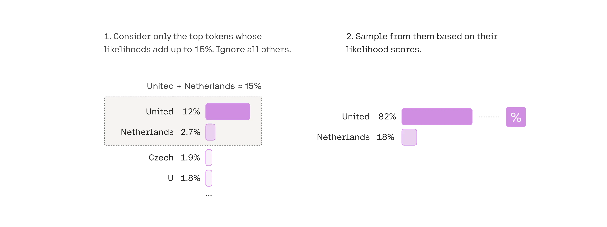

- [一、Temperature 温度系数作用](#一temperature-温度系数作用)
- [二、解码策略介绍](#二解码策略介绍)
- [三、top-p 采样算法](#三top-p-采样算法)
  - [3.1 top-p 采样算法步骤:](#31-top-p-采样算法步骤)
  - [3.2 top-p 采样代码](#32-top-p-采样代码)
- [参考资料](#参考资料)

## 一、Temperature 温度系数作用

Temperature 采样的温度系数意义、公式和知识蒸馏很相似，结合 softmax 的公式，都是如下形式:

$$q_i = \frac{exp(z_i/T)}{\sum_j^K exp(z_j/T)}$$

当 $T$ 趋于无穷大时，输出概率分布将趋于均匀分布，概率为 $1/K$, 此时信息熵是最大的。反过来，$T$ 趋于0时，正确类别的概率接近 $1$，输出结果就是确定的，信息熵为 0，`softmax` 的效果与 `argmax` 差不多.

应用代码如下所示：

```python
# logits 是 llm 推理输出, 形状为 [batch_size, seq_len, vocab_size]
probs = torch.softmax(logits[:, -1, :] / temperature, dim=-1)
```

代码详解：
- `logits[:, -1]` 表示选择的是最后一个位置（seq_len 维度的最后一项）对应的 `logits`，形状变为 [batch_size, vocab_size]。因为在生成模型中的 prefill 阶段，我们只关心当前生成的最后一个 token 的分布。
- temperature 作用是调整 logits 的分布，用于控制采样的随机性。总结就是，温度系数 $T$ 越大输出越平滑，结果越不确定，越小则越确定。具体来说，当 `temperature < 1.0`，分布会变得更加陡峭，更倾向于选择高概率的 token。`temperature > 1.0`，分布会变得更加平坦，增加随机性。

## 二、解码策略介绍

首先需要知道，**LLM 的输出结果只是下一个 `token` 的概率分布 `logits`**，即对下一个单词的预测概率张量，形状为 `[batch_size, seq_len, logits]`。而如何从概率分布中选择下一个单词，就是我要介绍的解码策略，也叫采样策略

解码策略里，常见的方法是是贪心策略，`Top-K` 采样和 `Top_p` 采样，这几个方法的不同点在于候选集的选择策略不同。

- 贪心策略取的是概率最大的 `Top1` 的样本作为候选项，也就是永远取概率最大的样本作为一个候选项，但这样只能保证是局部最优，也就是当前步是最优的，达不到全局最优。
- `Top-K` 采样取的是概率的前 `TopK` 的样本作为候选项, 也就是每一步都保留有 K 个候选项，能在一定程度上保证全局最优。但 top-k 有个问题就是 `k` 取多少，是最优的，这个难以确定。
- `Top-p` 采样，针对的就是 `K` 值难确定的问题，通过设定阈值 `p`, 根据候选集累积概率之和达到阈值 `p`，来选择候选项的个数，也叫核采样。

## 三、top-p 采样算法

`Top-p` 采样（也称为核采样，Nucleus Sampling）是一种用于自然语言生成模型的解码策略，旨在平衡生成文本的多样性和质量。核心思想是：在每一步生成 next_token 时，都从累积概率超过阈值 p 的tokens 集合中进行随机采样。具体操作是，每个时间步，按照 token出现的概率由高到底排序，当概率之和大于 `top-p` 的时候，就不考虑后面的低概率 tokens。



上图很好的展示了 Top-p 采样（Nucleus Sampling） 的过程，可以分为两个步骤：

**1，确定候选集**：左图显示如何根据累积概率选择候选集：
   - 每个单词（或 token）都有一个概率，例如：“United”: 12%，“Netherlands”: 2.7%，按照概率降序排列，逐步累加概率，直到累积概率达到阈值（例如 15%）。
   - 一旦达到阈值，忽略其他概率更低的词（如 “Czech” 和 “U” 被排除）。
   - 因此，此例中，候选集包括：`“United” (12%)`、`“Netherlands” (2.7%)`。

**2，从候选集中采样**: 右图显示如何从候选集中基于归一化概率进行采样：

- 候选集中的概率重新归一化。例如：
    - United”: 原概率 12% 占候选集的 82%（12% / 15%）。
    - “Netherlands”: 原概率 2.7% 占候选集的 18%（2.7% / 15%）。
- 根据归一化后的概率进行随机采样。最终生成的词可能是：“United”（较高概率）或 “Netherlands”（较低概率）。

很明显，top-p 采样方法可以动态调整候选词的数量，避免了固定数量候选词可能带来的问题。另外，可以发现，top_p 越小，则过滤掉的小概率 token 越多，采样时的可选项目就越少，生成结果的多样性也就越小。

### 3.1 top-p 采样算法步骤:

Top-p 采样的详细步骤：
1. 概率排序：对模型在当前时间步生成的所有词汇的概率进行降序排序。
2. 确定候选集：从排序后的词汇中，选择累积概率达到或超过设定阈值 p 的最小集合，记为 V_p。例如，若 p=0.9，则选择前几个词，使其概率之和至少为 0.9。
3. 归一化概率：对候选集 V_p 中的词汇的概率进行重新归一化，使其和为 1。
4. 随机采样：根据归一化后的概率分布，从候选集 V_p 中随机选择下一个生成的词。
5. token 索引映射：使用 `torch.gather` 函数将采样的索引映射回原始词汇表索引。

### 3.2 top-p 采样代码

`top-p` 采样代码详细解释：

```python
def sample_top_p(probs, p):
    """
    执行 Top-p (Nucleus) 采样, 从概率分布中采样下一个词。
    参数：
        probs (torch.Tensor): 概率分布张量，形状为 `[batch_size, vocab_size]`。
        p (float): 累积概率阈值，取值范围在 0 到 1 之间。
    返回：
        torch.Tensor: 采样得到的词索引，形状为 `[batch_size, 1]`。

    说明：
        Top-p 采样算法: 选择概率累积和超过阈值 p 的最小集合，将这些词的概率重新归一化后进行采样。
    """
    # 对概率分布进行降序排序。probs_sort: 排序后的概率值，形状与 probs 相同。probs_idx: 排序后的索引，用于映射回原始词汇表。
    probs_sort, probs_idx = torch.sort(probs, dim=-1, descending=True)
    # 计算排序后概率的累积和. 返回的 probs_sum 是累积概率分布。
    probs_sum = torch.cumsum(probs_sort, dim=-1)
    # 保留累积概率未超过阈值 p 的词汇的概率，其余词汇的概率被置为 0.0。
    mask = probs_sum - probs_sort > p # 创建掩码，对于每个位置，计算累积概率（不包括当前词）是否超过阈值 p。
    probs_sort[mask] = 0.0 # 将累积概率超过阈值 p 的词的概率置零。

    # 对剩余的概率重新归一化, 确保总和为 1。
    probs_sort.div_(probs_sort.sum(dim=-1, keepdim=True))
    # 从重新归一化的概率分布中采样下一个词. 返回的 next_token 是采样得到的词在排序后概率分布中的索引。
    next_token_sorted_idx = torch.multinomial(probs_sort, num_samples=1)
    # 在 probs_idx 的最后一维（dim=-1）中，使用 next_token_sorted_idx 作为索引，提取对应的值。沿着 dim=1（列）进行索引提取
    # NOTE: torch.gather 函数按照给定的索引张量 index，从输入张量中收集 (获取) 数据，并返回一个与索引张量形状一致的张量。
    next_token = torch.gather(probs_idx, -1, index = next_token_sorted_idx)
    
    return next_token # 返回采样得到的下一个词的索引
```

代码运行示例：

```bash
1. 输入概率分布： probs = [0.1, 0.3, 0.4, 0.15, 0.05]
2. 按降序排序： probs_sort = [0.4, 0.3, 0.15, 0.1, 0.05]
   原始索引：   probs_idx  = [2, 1, 3, 0, 4]
3. 计算累积概率： probs_sum = [0.4, 0.7, 0.85, 0.95, 1.0]
4. 根据 p=0.8 标记掩码： mask = [False, False, True, True, True]
5. 将超出范围的概率置零： probs_sort = [0.4, 0.3, 0, 0, 0]
6. 重新归一化： probs_sort = [0.5714, 0.4286, 0, 0, 0]
7. 根据概率采样： next_token_index = 0
8. 从原始索引还原： next_token = probs_idx[0] = 2
```

**重点函数解释**:

1，`torch.gather` 函数按照给定的索引张量 `index`，从输入张量中收集 (获取) 数据，并返回一个与索引张量形状一致的张量。

示例代码：
```python
import torch

# 创建一个 3x4 的输入张量
input_tensor = torch.tensor([[10, 20, 30, 40],
                             [50, 60, 70, 80],
                             [90, 100, 110, 120]])

# 创建一个包含索引的张量
index_tensor = torch.tensor([[3, 2, 1, 0],
                             [0, 1, 2, 3],
                             [1, 0, 3, 2]])

# 沿着 dim=1（列）进行索引提取
output_tensor = torch.gather(input_tensor, dim=1, index=index_tensor)

print(output_tensor)

"""
程序运行后输出:
tensor([[ 40,  30,  20,  10],
        [ 50,  60,  70,  80],
        [100,  90, 120, 110]])
对于 input_tensor 的第二行 [50, 60, 70, 80]，index_tensor 的第二行 [0, 1, 2, 3] 指示提取顺序为第二行的 0 列、第二行的第 1 列、第二行的第 2 列、第二行的第 3 列，结果为 [50, 60, 70, 80]。
"""
```

2，`torch.multinomial` 用于从概率分布中抽取样本，支持带放回和不带放回两种方式。具体来说，它的功能是基于输入的概率权重进行采样。

函数签名如下:

```python
torch.multinomial(input, num_samples, replacement=False, *, generator=None) -> LongTensor
```

参数解释：
1. `input`: 1D 或 2D 的张量，表示概率分布。它的值不需要是标准化的概率，但必须是非负的。如果是 2D 张量，每一行会被视为一个单独的分布。
2. `num_samples`: 需要采样的样本数量。
3. `replacement`: 是否是有放回采样。
    - 如果为 True，可以多次采样同一个索引。
    - 如果为 False，采样后不会重复选择。
4. `generator`（可选）: 控制采样随机性的生成器。

代码示例:

```python
import torch

# 定义一个概率分布
probs = torch.tensor([0.1, 0.3, 0.6])

# 从分布中采样 1 个样本（不放回）
sample_idx = torch.multinomial(probs, num_samples=1)
print("采样的索引:", sample_idx.item())

# 输出采样的索引可能为 2，因为其对应概率最大
```

## 参考资料

- [如何解释 top_p 和 temperature 参数对 LLM 生成多样性的影响](https://zhuanlan.zhihu.com/p/713270088)
- [ChatGPT 温度系数t与top-p, 超参怎么设置最优](https://zhuanlan.zhihu.com/p/631591713)
- [Top-k & Top-p](https://docs.cohere.com/docs/controlling-generation-with-top-k-top-p)