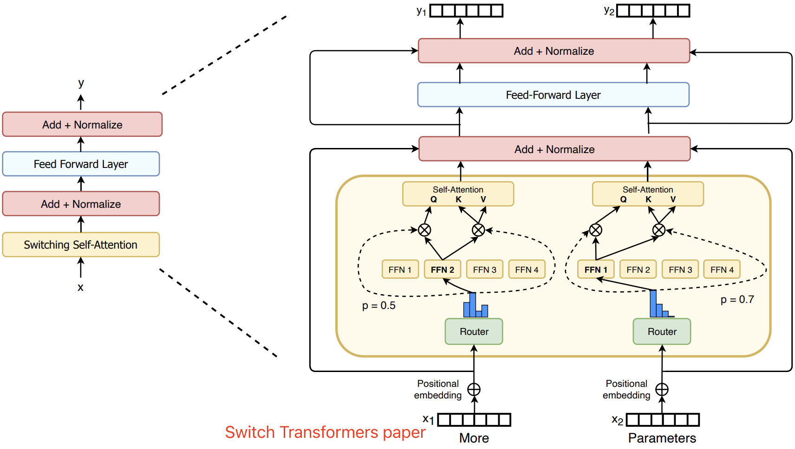
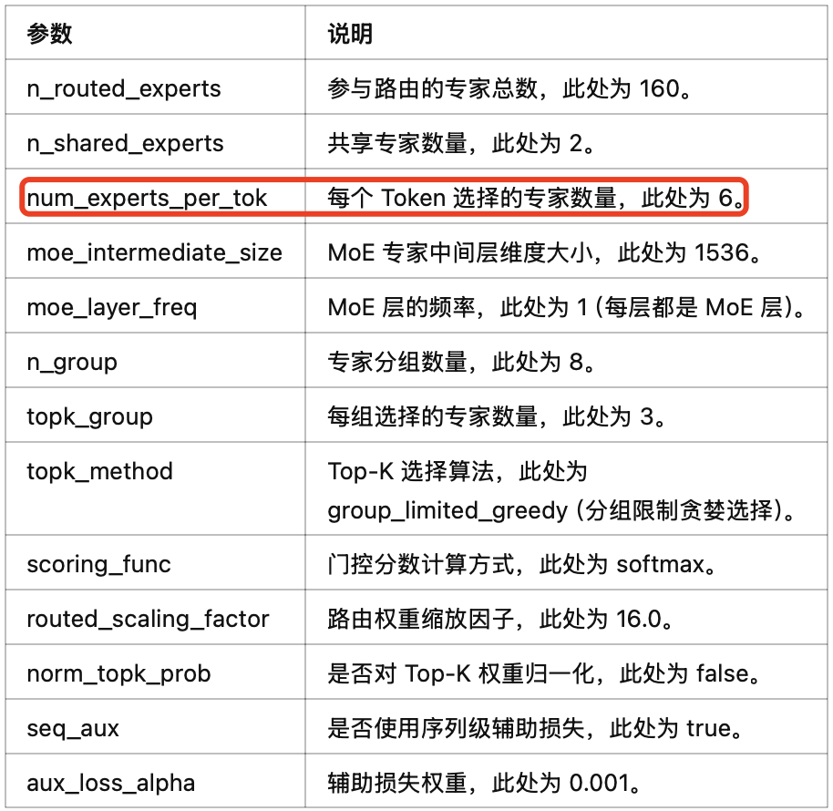

- [DeepseekMoE 结构概述](#deepseekmoe-结构概述)
  - [1.1 基础 MoE 结构介绍](#11-基础-moe-结构介绍)
  - [1.2 DeepseekMoE 结构介绍](#12-deepseekmoe-结构介绍)
- [二 Gate/TopkRouter 结构实现](#二-gatetopkrouter-结构实现)
- [三 DeepseekMoE 结构实现](#三-deepseekmoe-结构实现)
  - [3.1 DeepseekV2MLP 实现](#31-deepseekv2mlp-实现)
  - [3.3 DeepseekMoE 实现](#33-deepseekmoe-实现)
- [参考资料](#参考资料)

> 本文代码来源 transoformers 库的[代码实现](https://github.com/huggingface/transformers/blob/main/src/transformers/models/deepseek_v3/modeling_deepseek_v3.py)，不带并行策略。

## DeepseekMoE 结构概述

### 1.1 基础 MoE 结构介绍

`Mixtral` 8x7B (announcement, model card) 是高质量的混合专家模型 (Mixed Expert Models，简称 MoEs) 的 Transformer 模型，或者说是一种稀疏的 mixture-of-experts 模型，采用纯解码器结构，并使用 `MoE` 结构，替换原始的 `FFN` 结构。在每一层，对每个 `token`，存在一个 `router network` 会挑选两组 “experts”(即参数量更小的 FFN）来分别处理该 token，并通过**加法方式**融合两组 “experts” 的输出。

基础版的（稀疏）MoE 结构图如下图所示:



MoE 通常由两部分组成：
- **门控或 Router 网络**：模块负责根据输入 token 的特征动态选择激活哪些专家，路由器是由带学习的参数组成的网络。
- **“experts” 网络（小型 FFN）**：每层 MoE 都包含若干个（稀疏）专家网络，其通常是小型的 FFN，**在实际推理中只有部分专家(通常 8 个)会被激活参与计算**。

混合专家（MoE）参数说明：

<div align="center">

</div>

### 1.2 DeepseekMoE 结构介绍

和基础 MoE 结构的区别是：
1. **更精细地划分专家网络**，提升每个专家的专业性，提高知识表达的准确度。
2. **引入部分共享专家**，减少不同专家间的知识冗余，提升计算效率；所有 tokens 都会经过的共享专家，每个 token 会用计算的 Router 权重，来选择 topK 个专家，然后和共享的专家的输出一起加权求和。

`DeepseekMoE` 其实是有两类专家的：
- 共享专家（Shared Expert）：1 个共享专家，用于捕捉**通用**、全局的特征信息。
- 路由专家（Routed Experts）：每个 MoE 层都包含 256 个路由专家，负责精细化处理输入 tokens 的专业特征。

## 二 Gate/TopkRouter 结构实现

门控网络的作用是，根据输入 tokens 动态的选择 Top-K 个专家，并为每个 Token 分配权重。关键流程如下：
1. 展平输入：(batch, seq_len, hidden) -> (batch*seq_len, hidden)
2. 计算路由分数：router_logits = F.linear(hidden_states, weight)
3. 应用Sigmoid激活：scores = sigmoid(router_logits)
4. 调用分组选择策略：topk_indices = get_topk_indices(scores)
5. 收集topk权重：topk_weights = scores.gather(1, topk_indices)
6. 可选归一化：topk_weights /= sum(topk_weights)
7. 应用缩放因子：topk_weights *= routed_scaling_factor
8. 返回结果：(topk_indices, topk_weights)

其中分组选择机制说明如下:
1. 将专家划分为 n_group 个组，每组包含 n_routed_experts // n_group 个专家。
2. 每个组内取前 2 高分专家的得分总和作为组得分，选择 Top-K 组。
3. 仅保留选中组的专家，再在组内选择 Top-K 专家。

带注释的 `DeepseekV3TopkRouter` 类代码如下所示:

```python
class DeepseekV3TopkRouter(nn.Module):
    def __init__(self, config):
        super().__init__()
        self.config = config
        # 路由参数初始化
        self.top_k = config.num_experts_per_tok  # 每个token选择的专家数量
        self.n_routed_experts = config.n_routed_experts  # 路由专家总数
        self.routed_scaling_factor = config.routed_scaling_factor  # 权重缩放因子
        self.n_group = config.n_group  # 专家分组数量
        self.topk_group = config.topk_group  # 每组选择的专家数量
        self.norm_topk_prob = config.norm_topk_prob  # 是否归一化topk权重
        
        # 路由权重矩阵（专家数 × 隐藏层大小）
        self.weight = nn.Parameter(torch.empty((self.n_routed_experts, config.hidden_size)))
        
        # 专家分数修正偏置（用于平衡专家选择）
        self.register_buffer("e_score_correction_bias", torch.zeros(self.n_routed_experts))

    @torch.no_grad()
    def get_topk_indices(self, scores):
        """计算每个token应该路由到的top-k专家索引（带分组策略）"""
        # 1. 应用专家分数修正
        scores_for_choice = scores.view(-1, self.n_routed_experts) + self.e_score_correction_bias.unsqueeze(0)
        
        # 2. 分组计算：将专家分成n_group组，每组选top2专家并求和
        group_scores = (
            scores_for_choice.view(-1, self.n_group, self.n_routed_experts // self.n_group)
            .topk(2, dim=-1)[0]  # 取每组前2个分数
            .sum(dim=-1)  # 求和作为组分数
        )
        
        # 3. 选择分数最高的topk_group个组
        group_idx = torch.topk(group_scores, k=self.topk_group, dim=-1, sorted=False)[1]
        
        # 4. 创建组掩码（标记被选中的组）
        group_mask = torch.zeros_like(group_scores)
        group_mask.scatter_(1, group_idx, 1)  # 在选中组位置标记1
        
        # 5. 将组掩码扩展到专家级别
        score_mask = (
            group_mask.unsqueeze(-1)
            .expand(-1, self.n_group, self.n_routed_experts // self.n_group)
            .reshape(-1, self.n_routed_experts)
        )
        
        # 6. 过滤未选中组中的专家分数
        scores_for_choice = scores_for_choice.masked_fill(~score_mask.bool(), 0.0)
        
        # 7. 在过滤后的分数中选择top-k专家
        topk_indices = torch.topk(scores_for_choice, k=self.top_k, dim=-1, sorted=False)[1]
        
        return topk_indices

    def forward(self, hidden_states):
        """路由门控前向传播"""
        # 1. 展平输入：将(batch_size, seq_len, hidden_size)变为(batch_size*seq_len, hidden_size)
        hidden_states = hidden_states.view(-1, self.config.hidden_size)
        
        # 2. 计算路由分数（专家概率）
        # 使用float32确保数值稳定性
        router_logits = F.linear(
            hidden_states.type(torch.float32), 
            self.weight.type(torch.float32)
        )
        
        # 3. 应用sigmoid激活函数（不同于softmax，允许多专家选择）
        scores = router_logits.sigmoid()
        
        # 4. 获取top-k专家索引（带分组策略）
        topk_indices = self.get_topk_indices(scores)
        
        # 5. 收集对应的top-k权重
        topk_weights = scores.gather(1, topk_indices)
        
        # 6. 可选：归一化top-k权重（使权重和为1）
        if self.norm_topk_prob:
            denominator = topk_weights.sum(dim=-1, keepdim=True) + 1e-20  # 防止除零
            topk_weights /= denominator
        
        # 7. 应用路由缩放因子
        topk_weights = topk_weights * self.routed_scaling_factor
        
        return topk_indices, topk_weights
```

## 三 DeepseekMoE 结构实现

这里只考虑推理模式下的 DeepseekMoE 结构实现，且分步实现。

### 3.1 DeepseekV2MLP 实现

专家其实就是参数量更少的 FFN/MLP 结构，和 llama 中结构一样，只是参数量和计算量更少了，DeepseekV2MLP 代码如下所示。

```python
class DeepseekV2MLP(nn.Module):
    def __init__(self, config, hidden_size=None, intermediate_size=None):
        super().__init__()
        self.config = config
        self.hidden_size = config.hidden_size if hidden_size is None else hidden_size
        self.intermediate_size = (
            config.intermediate_size if intermediate_size is None else intermediate_size
        )

        self.gate_proj = nn.Linear(self.hidden_size, self.intermediate_size, bias=False)
        self.up_proj = nn.Linear(self.hidden_size, self.intermediate_size, bias=False)
        self.down_proj = nn.Linear(self.intermediate_size, self.hidden_size, bias=False)
        self.act_fn = ACT2FN[config.hidden_act] # silu 激活函数

    def forward(self, x):
        mlp_out = self.down_proj(self.act_fn(self.gate_proj(x)) * self.up_proj(x))
        return mlp_out
```


### 3.3 DeepseekMoE 实现

DeepseekMoE forward 函数了流程总结如下:

1. **门控计算**
   - 调用门控网络（self.gate），对输入 hidden_states 计算得到 top‑k 专家索引（topk_idx）、对应权重（topk_weight）以及辅助损失（aux_loss，推理时不参与梯度计算）。
2. **数据重排**
    - 将输入 hidden_states 展平为二维张量（形状 [B * T, d]），并将 topk_idx 也展平。
	- 在推理模式下，通常不需要像训练时那样对每个 token 进行 repeat_interleave，因为每个 token 只会由对应专家处理一次。
3. **专家计算**
	- 根据展平后的 `topk_idx`，依次对每个专家负责的 token 子集进行计算。
	- 由于这里可能存在多个 token 被分配给不同专家，实际实现中需要将每个专家的输出按顺序记录下来。
4. **输出重构与加权融合**
	- 将所有专家计算的输出进行合并。通过将输出重新整理（排序）回原始 token 顺序，并按照 topk_weight 对各个专家输出进行加权求和，从而获得最终输出。
	- 整个过程保证最终输出形状与原始输入保持一致，即 [B, T, d]。

DeepseekMoE forward 函数中，门控路由（self.gate）输出结果 `topk_indices, topk_weights` 和原始输入 `hidden_states` 共同作为 MoE 计算（self.moe）模块的输入参数；共享专家（self.shared_experts）的输出和 MoE 模块的输出做**逐元素相加后**得到 `DeepseekV3MoE` 组件的最终输出。

完整的 forward 函数注释代码如下所示：

```python
class DeepseekV3MoE(nn.Module):
    """
    A mixed expert module containing shared experts.
    """
    def __init__(self, config):
        super().__init__()
        self.config = config
        self.experts = nn.ModuleList(
            [
                DeepseekV3MLP(config, intermediate_size=config.moe_intermediate_size)
                for _ in range(config.n_routed_experts)
            ]
        )
        self.gate = DeepseekV3TopkRouter(config)
        self.shared_experts = DeepseekV3MLP(
            config=config, intermediate_size=config.moe_intermediate_size * config.n_shared_experts
        )

    def forward(self, hidden_states):
        residuals = hidden_states
        orig_shape = hidden_states.shape
        topk_indices, topk_weights = self.gate(hidden_states)
        hidden_states = hidden_states.view(-1, hidden_states.shape[-1])
        hidden_states = self.moe(hidden_states, topk_indices, topk_weights).view(*orig_shape)
        hidden_states = hidden_states + self.shared_experts(residuals)
        return hidden_states
```

`moe` 路由专家计算函数中使用 `one_hot` 编码将每个 `token` 的专家选择转换为**掩码操作**（经典用法），输入 topk_indices 形状: (batch_size, seq_len, topk)。输出形状: (batch_size, seq_len, topk, num_experts)。再使用 `permute` 函数调整掩码张量维度，将维度从 (batch_size, seq_len, topk, num_experts) 变为 (num_experts, batch_size, seq_len, topk)，方便后续计算每个 `expert` 的加权结果。

```python
# 创建专家掩码
expert_mask = torch.nn.functional.one_hot(topk_indices, num_classes=len(self.experts))
# 调整掩码维度
expert_mask = expert_mask.permute(2, 0, 1)
```

完整的 `moe_infer` 函数代码如下所示:

```python
def moe(self, hidden_states: torch.Tensor, topk_indices: torch.Tensor, topk_weights: torch.Tensor):
    # 1. 初始化输出张量
    final_hidden_states = torch.zeros_like(hidden_states, dtype=topk_weights.dtype)
    
    # 2. 创建专家掩码
    expert_mask = torch.nn.functional.one_hot(topk_indices, num_classes=len(self.experts))
    expert_mask = expert_mask.permute(2, 0, 1)
    
    # 3. 遍历所有专家
    for expert_idx in range(len(self.experts)):
        expert = self.experts[expert_idx]  # 获取当前专家
        mask = expert_mask[expert_idx]     # 获取当前专家的token分配掩码
        
        # 4. 找出分配给当前专家的token索引
        token_indices, weight_indices = torch.where(mask)
        
        # 5. 如果有token分配给该专家
        if token_indices.numel() > 0:
            # 6. 获取对应token的权重
            expert_weights = topk_weights[token_indices, weight_indices]
            
            # 7. 获取对应token的输入
            expert_input = hidden_states[token_indices]
            
            # 8. 专家计算
            expert_output = expert(expert_input)
            
            # 9. 加权输出
            weighted_output = expert_output * expert_weights.unsqueeze(-1)
            
            # 10. 累加到最终输出
            final_hidden_states.index_add_(0, token_indices, weighted_output)
    
    # 11. 恢复原始数据类型
    return final_hidden_states.type(hidden_states.dtype)
```

## 参考资料

- [Mixtral of Experts](https://arxiv.org/pdf/2401.04088)
- [Switch Transformers: Scaling to Trillion Parameter Models with Simple and Efficient Sparsity](https://arxiv.org/pdf/2101.03961)
- [混合专家模型 (MoE) 详解](https://huggingface.co/blog/zh/moe)
- [MoE 大模型架构与机制详解 —— 以 DeepSeek‑v3 为例](https://zhuanlan.zhihu.com/p/22570639120)