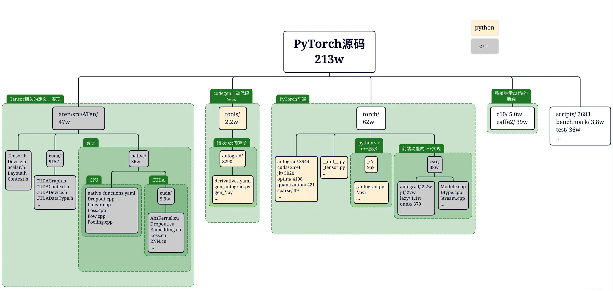
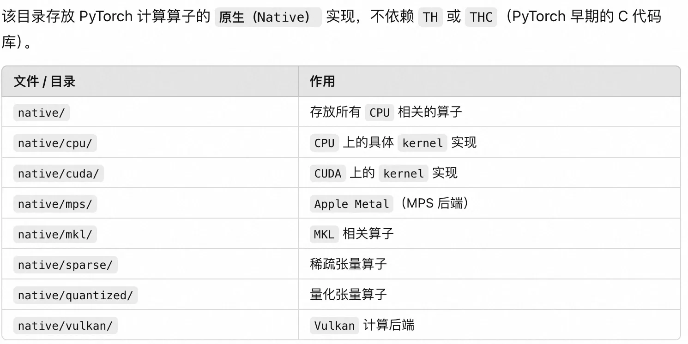

- [1. pytorch 代码库结构](#1-pytorch-代码库结构)
- [2. c10 核心基础库](#2-c10-核心基础库)
- [3. ATen 模块](#3-aten-模块)
- [参考资料](#参考资料)

## 1. pytorch 代码库结构

PyTorch 2.x 的源码主要划分为多个顶级目录，每个目录承担不同的功能，通过 `tree -L 1 -d` 显示当前目录的 `1` 层子目录。

```bash
├── android # 在 Android 平台上编译和部署 PyTorch 有关
├── aten    # ATen (“A Tensor”) 是 PyTorch 的张量库与算子库核心，实现了底层的张量数据结构、算子等基础。
├── benchmarks # 存放性能基准测试（benchmark）脚本及相关工具
├── binaries   # 存放编译后生成的可执行文件或脚本、工具，可能也用作打包产物输出目录
├── build      # 编译输出和中间产物
├── c10        # PyTorch 的核心基础库，包含常用数据结构（TensorImpl, Storage）和调度器（Dispatcher）、设备适配等的通用实现。
├── caffe2     # Caffe2 的遗留子目录，包含 Caffe2 自己的 core, utils, serialize 等部分
├── cmake      # 存放 CMake 脚本和配置模块
├── docs       # 存放文档
├── functorch  #  Functorch 项目集成到 PyTorch 源码，提供可对函数进行变换（vmap, grad等）的函数式功能和原型。
├── mypy_plugins # 存放mypy（Python 静态类型检查）的插件或自定义类型规则
├── scripts    # 辅助脚本
├── test       # PyTorch 的 测试用例目录：单元测试、集成测试
├── third_party #第三方依赖库 源码
├── tools      # 构建工具与脚本库，包含 build 系列脚本、jit 工具、onnx 工具、code_coverage, linter 等
├── torch      # PyTorch Python 包源码的核心实现
├── torch.egg-info
└── torchgen   # PyTorch 算子代码生成相关脚本和生成文件目录，如算子注册、shape 函数生成、static_runtime、decompositions 等。
```

虽然第一级的子目录很多，但是对于开发者来说，最核心和重要的子目录就那几个，简单总结下其作用和相互关系：

1. `c10/`：PyTorch 的**核心基础库目录**。
   - `c10` 子目录提供了**在各平台通用的基础构件**，包括 **Tensor 元数据和存储实现、调度分发机制（dispatcher）、流（Stream）、事件（Event）等**​。
   - 它其实是 PyTorch 和 Caffe2 合并后抽象出的统一核心层，“c10” 名字取自 “Caffe2” 与 “A Ten”的谐音（`C Ten`）。
   - `c10` 本身不包含算子的实现，它更多的是提供一些辅助张量自动微分机制的抽象模块和类。
2. `aten/`：`ATen` (“A Tensor”) 库目录。`ATen` 是 PyTorch 的**张量运算核心库**（`C++` 实现），提供张量及其操作的定义和实现​。它不直接包含自动求导逻辑，主要关注**张量的创建、索引、数学运算、张量运算等 `kernel` 操作和实现的功能**。`aten/src/ATen` 下有核心子目录：
    - `ATen/core`：ATen 的核心功能（部分正逐步迁移到顶层的 `c10` 目录）。
    - `ATen/native`：分算子（operators）的 `native` 实现。如果要新增算子，一般将实现放在这里​。根据设备类型又细分子目录:
      - `native/cpu`: 并非真正意义上的 CPU 算子实现，而是经过特定处理器指令（如 AVX）编译的实现。​。
      - `native/cuda`: 算子的 CUDA 实现。
      - `native/sparse`:  COO 格式稀疏张量操作在 CPU 和 CUDA 上的实现。
      - `native/quantized`: 量化张量（即 QTensor）算子的实现。
3. `torch/`：真正的 PyTorch 库，除 `csrc` 目录中的内容外，其余部分都是 Python 模块，遵循 PyTorch Python 前端模块结构。
    - `csrc`: 构成 PyTorch 库的 C++ 文件。该目录树中的文件混合了 **Python 绑定代码**和大量 `C++` 底层实现。有关 Python 绑定文件的正式列表，请参阅 `setup.py`；通常它们以 python_ 为前缀。
      - `jit`: TorchScript JIT 前端的编译器及前端。一个编译堆栈（TorchScript）用于从 PyTorch 代码创建可序列化和可优化的模型。
      - `autograd`: **自动求导（Autograd）系统实现**。系统的核心设计原则是为每个关键数据类型提供两套实现：C++ 类型和 Python 对象类型。以变量（Variable）为例，系统包含 variable.h 中的 Variable C++ 类型和 python_variable.h 中的 THPVariable Python 类型。
      - `api`: PyTorch 的 C++ 前端。
      - `distributed`: PyTorch 的分布式训练支持。
4. `tools`: 供 PyTorch 库使用的代码生成脚本。



## 2. c10 核心基础库

`c10` 作为 PyTorch 框架的**核心基础库**，其包含多个子模块：
- `c10/core/`：核心组件，定义了 PyTorch **核心数据结构和机制**。例如包含 `TensorImpl`（张量底层实现类）​、`Storage`（张量存储）、`DispatchKey` 和 `Dispatcher`（动态算子调度）、设备类型 `Device`、类型元信息 `TypeMeta` 等基础定义。
- `c10/util/`：工具模块，提供通用的 C++ 实用组件。如 intrusive_ptr 智能指针、`UniqueVoidPtr` 通用指针封装、`Exception` 异常处理、日志和元编程工具等，供整个框架使用。
- `c10/macros/`：宏定义模块，包含编译配置相关的宏。例如根据操作系统和编译选项生成的 cmake_macros.h，以及 C10_API, TORCH_API, CAFFE2_API 等符号导出控制宏​。
- `c10/cuda/`, c10/hip/, c10/metal/, c10/xpu/ 等：特定设备平台支持代码, 这些目录有助于在 c10 层面适配不同硬件平台。例如:
  - c10/cuda 中包含 **CUDA 后端初始化、流管理等与 CUDA 设备相关的基础功能**；
  - c10/hip 类似地对应 AMD 的 HIP；
  - c10/metal 针对苹 Metal 后端；
  - c10/xpu 则可能用于其他加速器（如 Intel XPUs）。
- `c10/mobile/`：移动端支持代码，为在移动/嵌入式场景下裁剪和优化 PyTorch 而设。
- `c10/test/`：c10 本身的一些单元测试代码。

## 3. ATen 模块

aten/（A Tensor Library）是 PyTorch 的核心组件，负责实现 Tensor 计算、自动微分（Autograd）、跨后端算子分发、算子在各个设备（cuda、cpu）上具体实现（aten/src/ATen/native/）。

aten/src/ATen/目录提供了 aten 模块的具体代码实现，核心子目录的作用如下所示：
- core/ ：核心函数库，逐步往 c10迁移中。定义 Tensor 的核心数据结构、类型系统和 API。
- native/：原生算子库。各后端（CPU、CUDA、XLA 等）的算子实际实现（如卷积、矩阵乘法）。
- autograd/：自动微分引擎（如 Variable、Function 的实现）。
- vulkan/、metal/：移动端和 GPU 后端支持。
- quantized/：量化算子实现。

aten/src/ATen/core 子模块
- 作用：定义 Tensor 的核心数据结构、类型系统和基础接口。
- 关键文件：
  - Tensor.h：Tensor 类的定义（核心分析对象）。
  - TensorBase.h：Tensor 的基类，提供轻量级接口。
  - DispatchKeySet.h：操作符分派机制（如 CPU/CUDA/Autograd 的动态分派）。
  - ScalarType.h：数据类型（dtype）的枚举定义。

aten/src/ATen/native 子模块
- 作用：各后端的原生算子实现。
- 关键子目录：
  - cpu/：CPU 算子实现（如 Conv2d.cpp）。
  - cuda/：CUDA 算子实现（如 CUDABlas.cpp）。
  - Composite/：组合算子（由基础算子拼接而成）。
  - meta/：元算子（用于形状推导）。



## 参考资料

- [万字综述，核心开发者全面解读PyTorch内部张量机制](https://mp.weixin.qq.com/s/8J-vsOukt7xwWQFtwnSnWw)