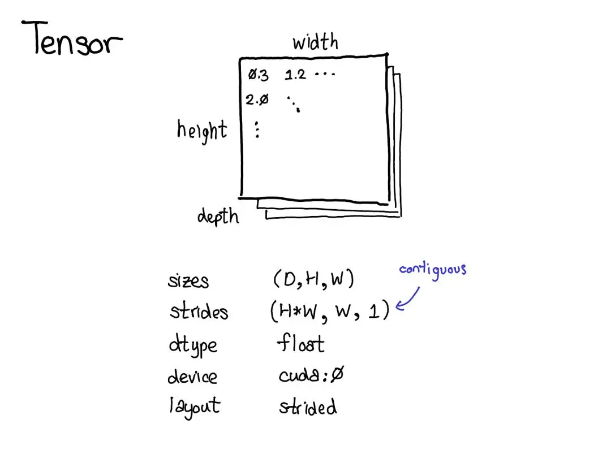

## 1. torch.Tensor 属性总结

`PyTorch` 框架本质上是一个支持自动微分的张量库，张量是 PyTorch 中的核心数据结构（`torch.Tensor`），其本质上是一种多维数组数据结构，拥有一组内置的属性来描述张量的**元信息**，如数据类型（`dtype`）、存储设备（`device`）、维度信息（`shape/size`）、内存布局（`layout`）等。

<div align="center">

</div>

张量核心属性总结：

| 属性名          | 含义                                                | 获取方式                         | 示例                                  |
| --------------- | --------------------------------------------------- | -------------------------------- | ------------------------------------- |
| `shape`         | 张量各维度大小                                      | `tensor.shape` / `tensor.size()` | `torch.Size([2, 3])`                  |
| `dtype`         | 张量中元素的数据类型                                | `tensor.dtype`                   | `torch.float32`, `torch.int64`        |
| `device`        | 张量存储所在的设备                                  | `tensor.device`                  | `cpu`, `cuda:0`                       |
| `requires_grad` | 是否被 autograd 记录梯度,用于构建计算图并反向传播。 | `tensor.requires_grad`           | `True` / `False`                      |
| `layout`        | 描述张量在内存中的存储格式                          | `tensor.layout`                  | `strided`(连续内存)、sparse(稀疏存储) |
| `is_leaf`       | 是否为计算图叶子节点                                | `tensor.is_leaf`                 | `True` / `False`                      |
| `storage`       | 张量的底层数据存储                                  | `tensor.storage()`               | `<torch.FloatStorage object>`         |
| `stride`        | 表示张量在各维度上移动一个元素所需跨越的内存步长    | `tensor.stride()`                | `(3, 1)`                              |
| `is_contiguous` | 是否在内存中连续                                    | `tensor.is_contiguous()`         | `True` / `False`                      |

查看张量属性实例代码：

```python
import torch

# 创建一个张量，并指定 dtype、device、requires_grad
x = torch.tensor([[1, 2, 3], [4, 5, 6]],
                 dtype=torch.float32,
                 device='cpu',
                 requires_grad=True)

# 查看各属性
print("Shape:", x.shape)              # torch.Size([2, 3])
print("Dtype:", x.dtype)              # torch.float32 
print("Device:", x.device)            # cpu
print("Requires Grad:", x.requires_grad)  # True 
print("Layout:", x.layout)            # torch.strided 
print("Is Leaf:", x.is_leaf)          # True 
print("Storage:", x.storage())        # [torch.storage.TypedStorage(dtype=torch.float32, device=cpu) of size 6]
print("Stride:", x.stride())          # (3, 1)
```

## 2. torch.Tensor 实现分析

PyTorch 中的张量在 C++ 层分布通过 `ATen`（A Tensor Library）和 `C10`（核心库）来实现，具体来说:

- `ATen`（A Tensor Library）：是 PyTorch 中**封装张量运算**的一层抽象，核心类型为 `at::Tensor`，并通过 aten/src/ATen/native/ 中的各种 C++ 函数（如 TensorShape.cpp、TensorAdvancedIndexing.cpp 等）实现具体运算。ATen 负责将高阶的张量运算映射到底层内核，常称之为 “张量库”。
- `C10`：提供了张量的核心数据结构和调度机制，包括 `c10::TensorImpl`、`c10::Storage`、`c10::DispatchKey` 等。C10 还管理张量的引用计数、并为不同后端（CPU、CUDA、Sparse 等）提供了可扩展的接口。

每个张量对象都包含以下关键信息：

1. 数据存储 (`Storage`)：底层连续内存块，用于实际保存张量元素。
2. 元信息 (`TensorImpl`)：包含设备信息、数据类型、维度、步幅（stride）、布局（layout）等，以及指向 Storage 的指针。
3. 自动求导信息（`AutogradMeta`）：若张量需要梯度，则在 TensorImpl 中挂载相应的梯度追踪结构。
4. `Dispatch Key`：用于根据数据类型、设备、布局等信息分发到相应的后端内核。


其中张量元信息类 TensorImpl 对象至少包含以下字段：

- `Device device_`：记录张量所在设备（CPU、CUDA:0、CUDA:1 等）。
- ScalarType dtype_：张量元素的数据类型（如 Float, Double, Int, Bool 等）。
- TensorStorage storage_：指向底层 Storage 对象，用于实际存储张量数据。
- IntArrayRef sizes_：张量各维度的长度。
- IntArrayRef strides_：张量各维度的步幅，用于根据索引计算数据偏移。
- Layout layout_：表示张量存储布局，如稠密（strided）、稀疏（sparse_coo）、MKLDNN 等
- DispatchKeySet key_set_：用于调度运算到正确的内核，比如 CPUTensorId、CUDATensorId、Autograd 等。

## 3. torch.Tensor 属性实现分析

对于 `dtype` 属性，PyTorch 在 C++ 端使用枚举类型 `at::ScalarType` 来表示各种数据类型（如 `Float, Double, Int` 等），然后通过 Python API 暴露为 torch.float32、torch.int64 等 Python 对象；访问 tensor.dtype 时，底层会查询对应的 at::TensorImpl 中保存的 scalar_type 字段并将其封装为 Python 对象返回。pytorch/c10/core/ScalarType.h 头文件中的核心宏 `AT_FORALL_SCALAR_TYPES_WITH_COMPLEX_AND_QINTS` 定义了一个包含45种不同标量类型的完整列表，从基础的 uint8_t（Byte）到最新的 8位浮点格式如 Float8_e4m3fn 和量化类型。

对于 `device`，底层同样在 `at::TensorImpl` 中保存一个 `Device` 对象，Python API 访问时将其包装为 torch.device 对象；当执行张量迁移（如 .to(device)、.cuda()、.cpu()）时，PyTorch 会在底层拷贝或移动张量数据到指定设备，并更新 TensorImpl 中的 device 字段。

对于 `shape / size`，底层使用 `TensorImpl` 中的维度信息（`sizes_` 数组）来存储；Python 访问时会将该数组封装为 torch.Size 对象（本质上是 Python 的 tuple 子类）返回。

对于 requires_grad / grad，PyTorch 在创建张量时会根据 requires_grad 参数决定是否为该张量分配梯度存储；在执行反向传播时（tensor.backward()），底层的 Autograd 引擎会自动追踪与该张量相关的运算，并将梯度信息累积到 tensor.grad 属性中。
