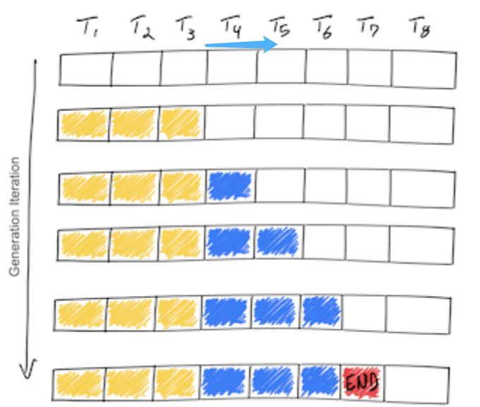
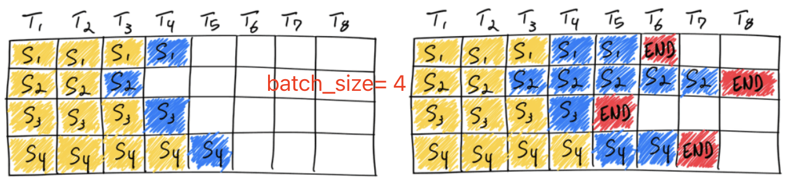
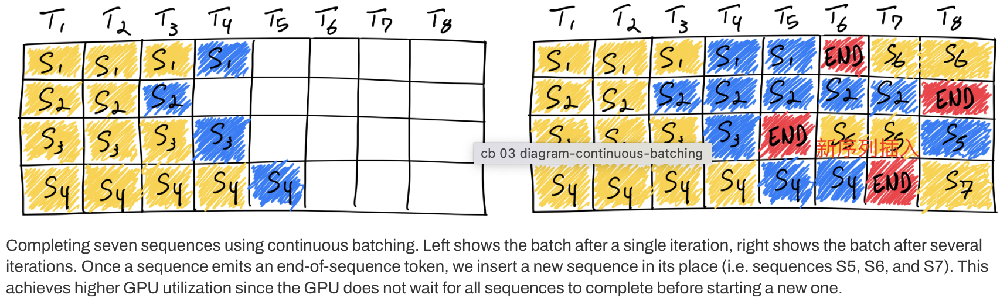

vLLM is a fast and easy-to-use large model inference serving framework, claiming the following fast features:
- SOTA serving throughput
- Efficient management of KV cache with PagedAttention
- Continuous batching of incoming requests instead of static batching
- High-speed model execution with CUDA/HIP graphs
- Support for multiple quantization schemes: GPTQ, AWQ, INT4, INT8, and FP8
- High-performance CUDA kernels like FlashAttention
- Support for tensor parallelism and parallel sampling
- Support for chunked prefill processing

## 1. PagedAttention

The PagedAttention technique essentially optimizes the management and access of the KV cache. Previously, the KV cache technique had issues with GPU memory waste. The size of the KV cache for each sequence depends on seq_len, and since LLMs perform batch inference where each sequence in the batch may have different lengths and output token numbers, to avoid the problem of insufficient KV cache memory allocation, early KV cache implementations uniformly allocated memory based on max_seq_len. This obviously led to GPU memory resource waste during the decode phase.

```python
class Attention(nn.Module):
    def __init__(self, args: ModelArgs):
        super().__init__()
        # Initialize caches to store Key, Values at start. (KV Cache Implementation)
        self.cache_k = torch.zeros((args.max_batch_size, args.max_seq_len, self.n_kv_heads, self.head_dim), device=args.device)
        self.cache_v = torch.zeros((args.max_batch_size, args.max_seq_len, self.n_kv_heads, self.head_dim), device=args.device)
```

### 1.1 PagedAttention Solution

> The vAttention paper proposes to directly allocate contiguous virtual memory and perform physical memory mapping using CUDA’s underlying virtual memory and physical memory allocation APIs, thereby avoiding a series of engineering hassles and high overheads brought by PagedAttention needing to manually maintain block tables and physical memory allocations. Moreover, for new attention architectures that want to use PagedAttention, they need to adapt PagedAttention from the perspective of GPU kernels and restructure the attention kernel code.

Inspired by the virtual memory and paging mechanisms in operating systems, vLLM proposes the PagedAttention algorithm to achieve dynamic memory allocation for the KV cache, instead of previously allocating a fixed size of [max_seq_len, hidden_dim] contiguous memory space for each sequence to store the KV cache.

Specifically, PagedAttention logically divides each sequence into a certain number of blocks, where each block contains the keys and values of a certain number of tokens from each sequence. These logical blocks are mapped to physical blocks of fixed size through a block table; physical blocks may be non-contiguous, meaning that KV may be distributed non-contiguously. In short, it constructs a block table and divides the KV tokens of sequences into logical blocks that are mapped to physical blocks. The generation process of requests using PagedAttention is shown in the following figure:

The memory waste in this method only occurs in the last block of a sequence, and in practice, it brings nearly optimal memory usage with less than 4% waste. This improvement in memory efficiency greatly increases the number of sequences the system can process simultaneously, increases GPU utilization, and significantly improves throughput.

PagedAttention’s structure is similar to virtual memory in operating systems, where blocks are viewed as pages, tokens as bytes, and sequences as processes. The logical contiguous blocks of sequences are mapped to non-contiguous physical blocks through a block table. As new tokens are generated, these physical blocks are allocated on demand.

### 1.2 Advantages of PagedAttention in Memory Sharing

PagedAttention also has efficient memory sharing capabilities. For example, in parallel sampling, multiple output sequences can be generated from the same prompt. In this case, the computations and memory of the prompt can be shared among the output sequences. PagedAttention naturally achieves memory sharing through its block table, similar to processes sharing physical pages. Different sequences can achieve sharing by mapping their logical blocks to the same physical blocks. To ensure safe sharing, PagedAttention tracks physical blocks through reference counting and implements a “copy-on-write” mechanism.

PagedAttention’s memory sharing significantly reduces the memory overhead of complex sampling algorithms (such as parallel sampling and beam search), reducing their memory usage by up to 55% and increasing throughput by up to 2.2 times. This makes these sampling methods more practical in LLM services.

By leveraging a block table, PagedAttention achieves a flexible memory sharing mechanism. Similar to how processes share physical pages, different sequences in PagedAttention can share memory resources by mapping their respective logical blocks to the same physical blocks. To ensure safe sharing, PagedAttention tracks the reference count of physical blocks and adopts a copy-on-write strategy to prevent data conflicts.

## 2. Continuous Batching

Understanding the principle of continuous batching technology through diagrams.

### 2.1 Overview of Static Batching

Before understanding static batching, let’s revisit the inference process of LLMs: LLM inference consists of two stages: prefill and decode. Strictly speaking, the decode stage is the iterative process, where only one token is generated in each iteration. The inference process of LLMs is shown in the following figure:



The iterative process of LLM inference has some characteristics:

1. The iterative computation process in the decode stage is memory-bound. Since the input q has only one token, it cannot fully utilize the GPU’s parallel computing capabilities.
2. The GPU memory consumption increases with the model size and the length of the input token sequence.

The above figure shows the inference process of a single sequence. Now let’s look at the traditional batch inference process, also known as static batching. This means that the next batch of sequences cannot be inferred until the current batch is fully processed. However, there is a problem: in the previous batch, the sequence lengths and output token numbers are different, i.e., the iteration end times are different, which naturally leads to low GPU utilization. The static batching of LLMs is illustrated as follows:



The figure above shows a static batching process with batch_size = 4. In the first iteration (left side), each sequence generates one token (blue) from the prompt tokens (yellow). After several iterations (right side), the sequences complete at different lengths because each sequence emits its own end-of-sequence token (red) at different iterations. Although sequence 3 finishes after two iterations, static batching means that the previously allocated GPU thread resources remain underutilized until the last sequence in the batch completes generation (sequence 2, which completes after six iterations in this example).

Obviously, static batching only achieves optimal GPU utilization when the sequences in the batch have exactly the same number of input and output tokens.

### 2.2 Dynamic Batching Solution

Dynamic batching, also known as continuous batching technology, was first proposed in the 2022 paper Orca: A Distributed Serving System for Transformer-Based Generative Models. It greatly improves the throughput of LLM inference serving systems and effectively avoids GPU resource waste.

The principle of continuous batching is to dynamically adjust the batch size during iterations. Instead of waiting for all sequences in the batch to finish generating before proceeding to the next batch, it determines the current batch size based on the completion status of sequences in each iteration and the current remaining GPU memory resources. When some sequences in the batch are completed, new sequences can be immediately inserted into their positions, effectively avoiding GPU idling.



The figure above shows the inference of 7 sequences completed continuously through continuous batching technology. The left figure shows the batch after the first iteration, and the right figure shows the batch after several iterations. Whenever a sequence emits an end-of-sequence token, we insert a new sequence into its position (e.g., sequences S5, S6, and S7). This way, the GPU does not need to wait for all sequences to finish before starting to process new sequences, thereby achieving higher GPU utilization.

The brief description above ignores the prefill process of LLM inference because the computation modes of the prefill stage and the generation stage are different, so they cannot be simply batched together with the tokens in the generation stage. Therefore, general continuous batching frameworks manage this issue through a hyperparameter called waiting_served_ratio (in practice, frameworks have multiple hyperparameters and scheduling strategies). This parameter represents the ratio of prefill requests to waiting end-of-sequence token requests. Suppose the value is 1.3; when the ratio of prefill requests to waiting end-of-sequence token requests exceeds 1.3, the inference framework will pause the decode process of the batch and insert a corresponding number of new requests to perform prefill processing.

## Serving Scheduling Strategies

[TODO]

## References
- [How continuous batching enables 23x throughput in LLM inference while reducing p50 latency](https://www.anyscale.com/blog/continuous-batching-llm-inference)
- [vLLM: Easy, Fast, and Cheap LLM Serving with PagedAttention](https://blog.vllm.ai/2023/06/20/vllm.html)